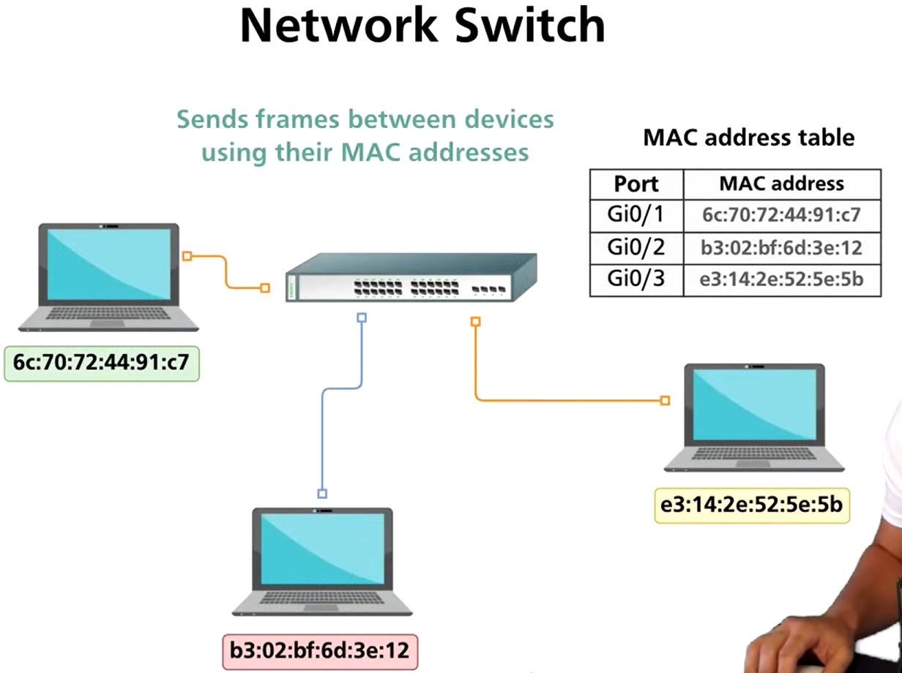
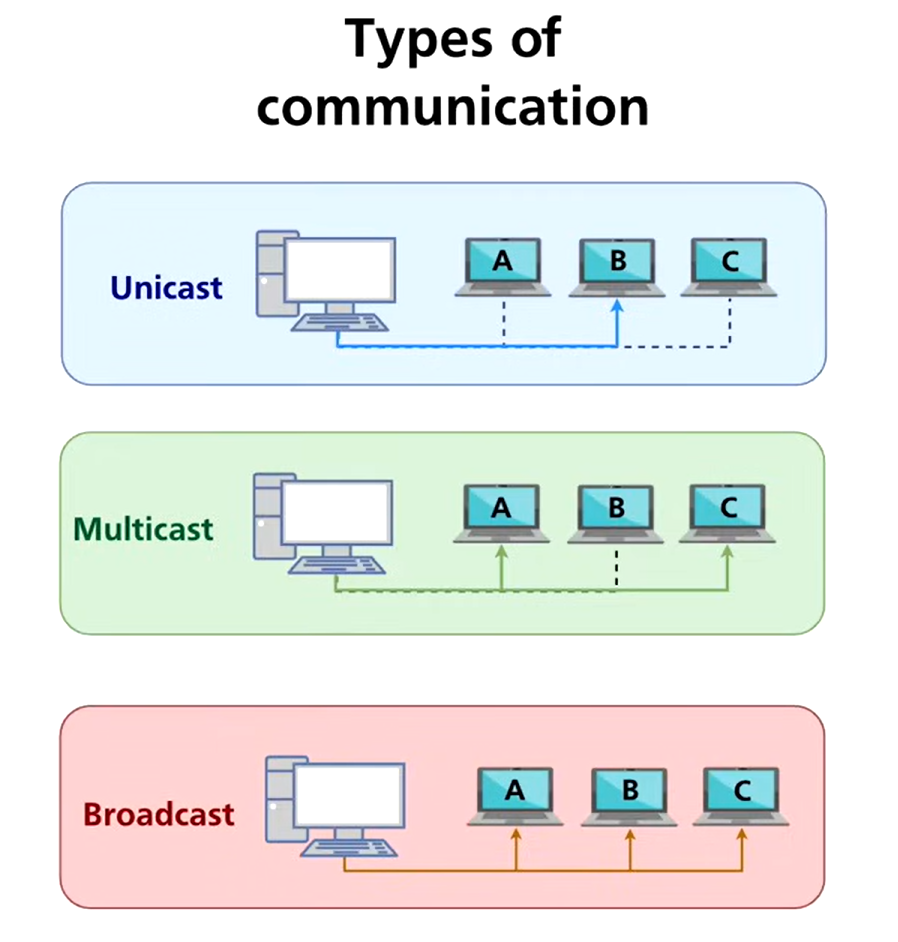
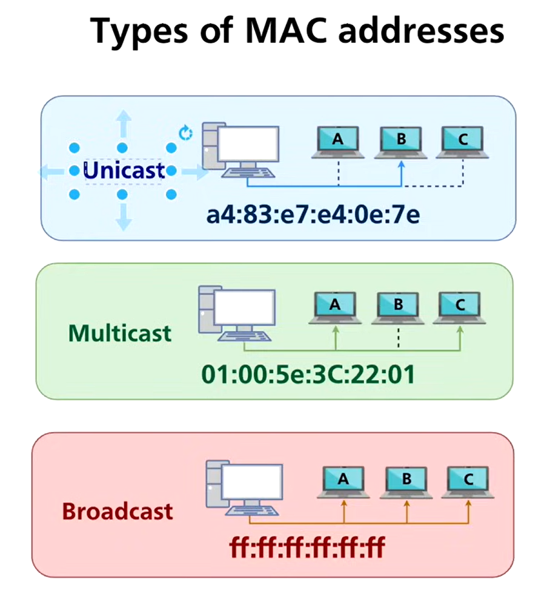
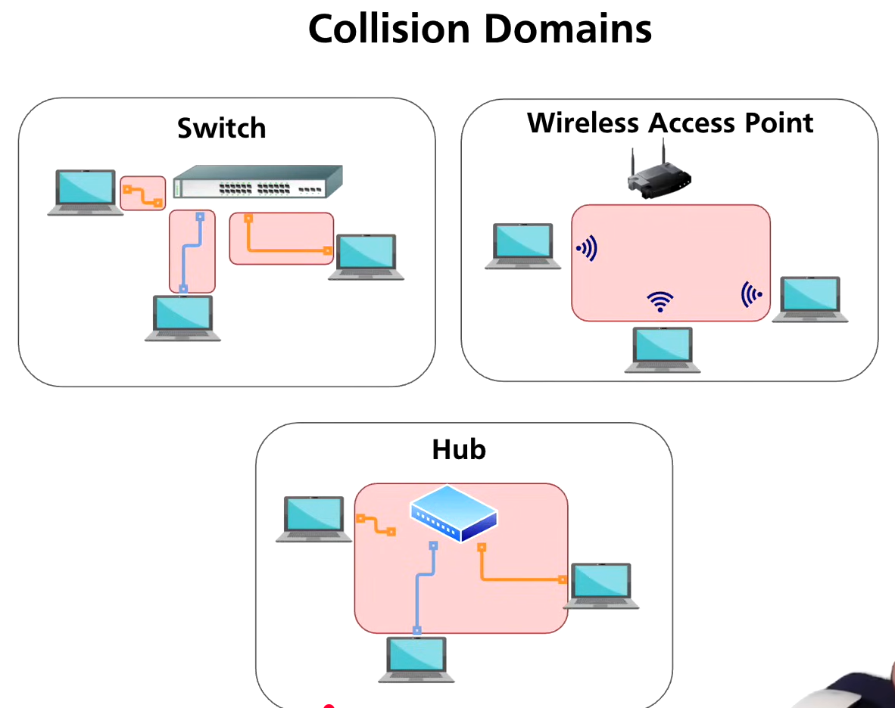
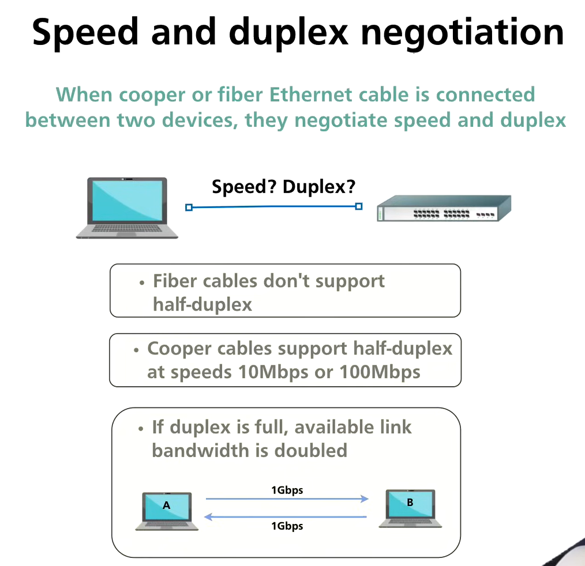

# Data link layer

## ***Network Switch (Data Link Layer – Layer 2)***

### What is a Network Switch?

- A **network switch** is a **Layer 2 networking device** used to connect multiple devices within a **Local Area Network (LAN)**.
- It forwards data based on **MAC addresses**, unlike hubs which broadcast blindly.
- Switches operate primarily at the **Data Link Layer**, though modern switches may also have Layer 3 capabilities.

---

## Functions of a Network Switch

- **Frame forwarding** based on MAC addresses
- **Traffic isolation** (each port is a separate collision domain)
- **Efficient bandwidth usage**
- **MAC address learning**
- **Reducing collisions** compared to hubs

---

## How a Network Switch Works (MAC Address Table)

### MAC Address Table (CAM Table)

- A switch maintains a **MAC address table** (also called a **CAM table**).
- This table maps:
    - **MAC Address → Switch Port**

### MAC Learning Process

1. A frame enters the switch through a port.
2. The switch reads the **source MAC address**.
3. The switch stores the source MAC and incoming port in the MAC table.
4. This entry is kept for a limited time (aging).

### Frame Forwarding Process

### Case 1: Known Destination MAC

- If the destination MAC exists in the table:
    - The switch forwards the frame **only to the specific port**.

### Case 2: Unknown Destination MAC

- If the destination MAC is **not in the table**:
    - The switch **floods** the frame to all ports except the source port.

### Case 3: Broadcast MAC Address

- Destination MAC: `FF:FF:FF:FF:FF:FF`
- Frame is sent to **all ports**.

---

## Switch Behavior Summary

- Switches learn from **source MAC addresses**
- Switches forward using **destination MAC addresses**
- Each switch port is its own **collision domain**

---

## ***Ethernet Frame Structure***

### Overview

- Ethernet uses **frames** as its PDU.
- Each frame consists of headers, optional fields, payload, and trailer.

---

## Ethernet Frame Fields (In Order)

### 1. Preamble (7 bytes)

- Used for **synchronization** between sender and receiver.
- Allows the receiving NIC to synchronize its clock.

### 2. Start Frame Delimiter (SFD) (1 byte)

- Indicates the **start of the actual frame**.
- Marks the end of the preamble.

---

### 3. Destination MAC Address (6 bytes)

- Indicates the **intended receiving device**.
- Checked first by switches and NICs.

### Why Destination MAC Comes Before Source MAC

- Switches need to **immediately determine where to forward the frame**.
- Reading destination MAC first allows **fast forwarding decisions**.

---

### 4. Source MAC Address (6 bytes)

- MAC address of the **sending device**.
- Used by switches for **MAC table learning**.

---

### 5. Optional VLAN Tag (4 bytes – Optional)

- Present when **802.1Q VLAN tagging** is used.
- Inserted between Source MAC and Type field.

VLAN Tag Contains:

- VLAN ID
- Priority bits

---

### 6. Type / Length Field (2 bytes)

- Indicates the **upper-layer protocol**:
    - IPv4
    - IPv6
    - ARP

---

### 7. Data / Payload (46–1500 bytes)

- Contains **actual user data**.
- Minimum payload size: 46 bytes
- Maximum payload size: 1500 bytes (standard Ethernet MTU)

---

### 8. Frame Trailer (FCS / CRC) (4 bytes)

### Frame Check Sequence (FCS)

- Used for **error detection**.
- Calculated using **Cyclic Redundancy Check (CRC)**.
- If errors are detected:
    - Frame is discarded

---

## **Total Size of Ethernet Frame**

### Without VLAN Tag

| Field | Size (Bytes) |
| --- | --- |
| Preamble | 7 |
| SFD | 1 |
| Destination MAC | 6 |
| Source MAC | 6 |
| Type | 2 |
| Payload | 46–1500 |
| FCS | 4 |
| **Total** | **64–1518 bytes** |

---

### With VLAN Tag

| Field | Size (Bytes) |
| --- | --- |
| VLAN Tag | 4 |
| **Total Frame Size** | **68–1522 bytes** |

---

## ***Ethernet Frame Overhead***

### Overhead Components

- Preamble + SFD
- Destination MAC
- Source MAC
- Type field
- FCS
- Optional VLAN tag

### Total Overhead (Without VLAN)

- **18 bytes** (excluding preamble & SFD)
- **26 bytes** (including preamble & SFD)

### Total Overhead (With VLAN)

- **22 bytes** (excluding preamble & SFD)
- **30 bytes** (including preamble & SFD)

---

## Fast Forward Switching (Modern Switches)

### What is Fast Forward Mode?

- Switch starts forwarding a frame **as soon as the destination MAC is read**.

### Advantages

- Very low latency
- High-speed switching

### Disadvantages

- Error frames may be forwarded (CRC not yet checked)

---

## Cybersecurity Relevance

- MAC flooding attacks target switch MAC tables
- VLAN hopping abuses VLAN tagging
- Frame analysis is critical in Wireshark

---

## Exam-Oriented Key Points

- Switches forward frames using MAC tables
- Destination MAC is read before source MAC
- Ethernet payload max = 1500 bytes
- CRC/FCS provides error detection
- VLAN tag increases frame size

## ***Types of Communication***

### 1. Unicast

- **Definition:** Communication between a **single sender** and a **single receiver**.
- **Use case:** Most common form of communication in networks.
- **Example:** Sending a packet from your PC to a server.

### 2. Multicast

- **Definition:** Communication from a **single sender** to a **specific group of receivers**.
- **Use case:** Streaming video to multiple users, IPTV.
- **Example:** Video conference with multiple participants.

### 3. Broadcast

- **Definition:** Communication from a **single sender** to **all devices on the network segment**.
- **Use case:** ARP requests, DHCP discovery.
- **Example:** Network-wide message asking “Who has IP 192.168.1.5?”

---

## Types of MAC Addresses

### 1. Unicast MAC Address

- Unique address assigned to a single NIC.
- Frames with unicast MAC are delivered **only to that device**.

### 2. Multicast MAC Address

- Identifies a **group of devices**.
- Frames are delivered to **all devices in the multicast group**.
- Range: `01:00:5E:00:00:00` to `01:00:5E:7F:FF:FF` (IPv4 multicast)

### 3. Broadcast MAC Address

- Special MAC: `FF:FF:FF:FF:FF:FF`
- Frames delivered to **all devices in the broadcast domain**.
- Used for ARP requests, DHCP, etc.

---

## Duplex Communication

### 1. Half Duplex

- **Definition:** Data transmission can occur in **one direction at a time**.
- **Used in:** Legacy hubs, some switch ports if forced.
- **Disadvantage:** Collisions possible, slower effective throughput.

### 2. Full Duplex

- **Definition:** Data transmission occurs **simultaneously in both directions**.
- **Used in:** Modern switches, NICs, and fiber links.
- **Advantage:** No collisions, better throughput.

---

## Collisions

### Definition

- A **collision** occurs when **two devices transmit at the same time** on the same medium.
- Only possible in **half-duplex networks**.

### Collision Handling Mechanisms

### 1. IEEE 802.3 – CSMA/CD (Ethernet)

- **Carrier Sense Multiple Access / Collision Detection**
- Steps:
    1. Listen before transmitting
    2. Transmit if medium is idle
    3. If collision occurs, stop and send jam signal
    4. Wait a random backoff time and retransmit

### 2. IEEE 802.11 – CSMA/CA (Wireless LAN)

- **Carrier Sense Multiple Access / Collision Avoidance**
- Steps:
    1. Listen before transmitting
    2. If idle, transmit after short inter-frame spacing
    3. If busy, wait for random backoff
- Wireless cannot detect collisions easily, so **avoidance is key**

---

## Collision Domains

| Device | Collision Domain |
| --- | --- |
| Hub | Entire hub is **one domain**, collisions common |
| Switch | Each port is a **separate collision domain**, collisions rare |
| Wireless Access Point | All devices on same channel may share **one collision domain**, managed via CSMA/CA |

---

## Speed and Duplex Negotiation

### Auto-Negotiation

- Switch ports and NICs can automatically negotiate:
    - Speed (10/100/1000 Mbps)
    - Duplex (half/full)

### Why Disable Half Duplex?

- Half-duplex causes collisions and performance issues.
- Modern networks are **full-duplex capable**.
- Recommendation: Force **full-duplex mode** to avoid collisions and improve reliability.
- Only leave auto-negotiation on **if all devices fully support it**.

---

## Exam & Practical Key Points

- **Unicast vs Multicast vs Broadcast:** Identify which MAC address type and frame type is used
- **Full duplex > Half duplex:** Better throughput, no collisions
- **CSMA/CD:** Wired Ethernet, collision detection
- **CSMA/CA:** Wireless, collision avoidance
- **Collision domain:** Switch ports are separate, hubs share one
- **Disable half-duplex:** Prevent collisions and maximize performance

## ***Wireshark Ethernet Frame Analysis***

This note covers analyzing **Unicast and Broadcast Ethernet frames** in Wireshark, with details about headers, MAC addresses, VLAN tags, Ethertypes, CRC/FCS, and protocol interpretation.

---

## 1. Analyzing Unicast Ethernet Frame Header

### Overview

- **Unicast frame:** Sent from a single source to a single destination.
- Wireshark captures frames starting from **Layer 2**, but some fields are **not visible**.

### 1.1 Preamble and SFD

- **Preamble (7 bytes)** and **Start Frame Delimiter (1 byte)** are **physical layer elements**.
- **Not captured by Wireshark**, because Wireshark starts capturing at the **Data Link Layer** (after preamble/SFD).

### 1.2 OUI Replacement with Vendor Name

- The **first 3 bytes of the MAC** are the **OUI (Organizationally Unique Identifier)**.
- Wireshark **replaces OUI with vendor name** for easier readability.
- Example: `00:1A:2B:xx:xx:xx` → “Cisco Systems”

### 1.3 7th Bit – Global / Factory Default

- The **7th bit of the first byte** (U/L bit) indicates:
    - `0` → **Globally unique MAC / factory default**
    - `1` → **Locally administered MAC**
- Wireshark automatically interprets this.

### 1.4 8th Bit – Individual / Group Address

- The **8th bit of the first byte** indicates:
    - `0` → **Individual (unicast) address**
    - `1` → **Group / multicast address**

### 1.5 VLAN Tag Absence in Wireshark

- If the network is not using VLAN tagging, the **802.1Q tag field is absent**.
- Wireshark shows the frame as **standard Ethernet II frame**.

### 1.6 Ethertype Field

- Indicates the **protocol of the payload**.
- Common Ethertypes:
    
    
    | Ethertype | Protocol |
    | --- | --- |
    | 0x0800 | IPv4 |
    | 0x0806 | ARP |
    | 0x86DD | IPv6 |
    | 0x8847 | MPLS |
- Wireshark uses Ethertype to **decode the next protocol layer**.

### 1.7 CRC / FCS Field

- Frame Check Sequence (FCS, 4 bytes) used for error detection.
- **Not shown in Wireshark** because:
    - Most NICs **strip FCS** before passing frames to the OS.
    - Wireshark captures from the OS, not raw physical layer.

---

## 2. Analyzing Broadcast Ethernet Frame Header

### Overview

- **Broadcast frame:** Sent from one device to **all devices in the broadcast domain**.
- Destination MAC: `FF:FF:FF:FF:FF:FF` (all 1s).

### 2.1 Common Broadcast Frames

- **ARP Requests**: Who has IP X.X.X.X?
- **DHCP Discover**: Client requesting IP from any DHCP server

### 2.2 Destination MAC

- Set to **all Fs** (`FF:FF:FF:FF:FF:FF`)
- Indicates that **all nodes** on the local network should process this frame

### 2.3 Source MAC

- Source MAC is always **unicast MAC of sending NIC**
- Helps receivers know **who sent the request**, for reply purposes

### 2.4 ARP Analysis Example in Wireshark

- ARP Request frame:
    - Dest MAC: Broadcast (`FF:FF:FF:FF:FF:FF`)
    - Source MAC: Sender NIC
    - Protocol type: 0x0806 (ARP)
- ARP Reply frame:
    - Dest MAC: Original sender’s MAC
    - Source MAC: Responder’s MAC

### 2.5 DHCP Analysis Example in Wireshark

- DHCP Discover frame uses **broadcast MAC** as destination
- DHCP server responds using **unicast MAC** if possible or broadcast if client IP unknown

### 2.6 Other Notes

- CRC/FCS also **not visible** in broadcast frames for same reasons as unicast
- Wireshark decodes broadcast frames the same way as unicast, except for **destination MAC**

---

## Summary / Key Points

- Wireshark captures **after physical layer**, so **preamble/SFD and FCS are hidden**
- OUI is replaced with **vendor name**
- 7th bit = `0` → global MAC, 8th bit = `0` → unicast/individual
- Ethertype indicates payload protocol (IPv4, ARP, IPv6, MPLS)
- Broadcast frames use **all Fs** as destination MAC
- Source MAC is **always unicast** to identify sender
- VLAN tags appear only if 802.1Q tagging is used
- ARP and DHCP use broadcast destination for discovery
- Unicast is for one-to-one communication; broadcast for one-to-all