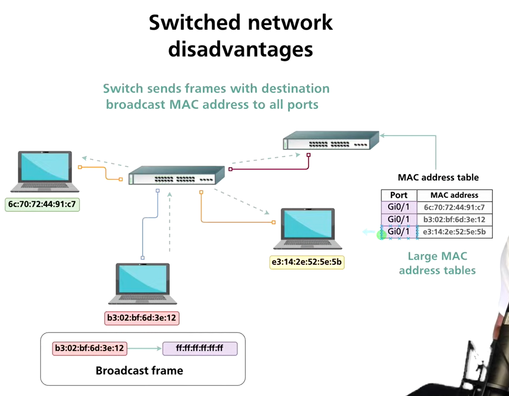
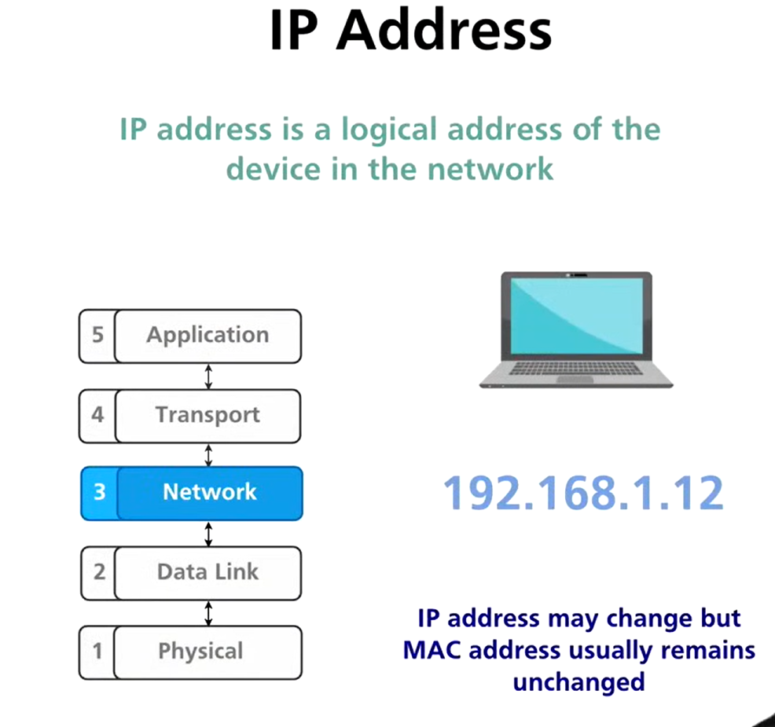
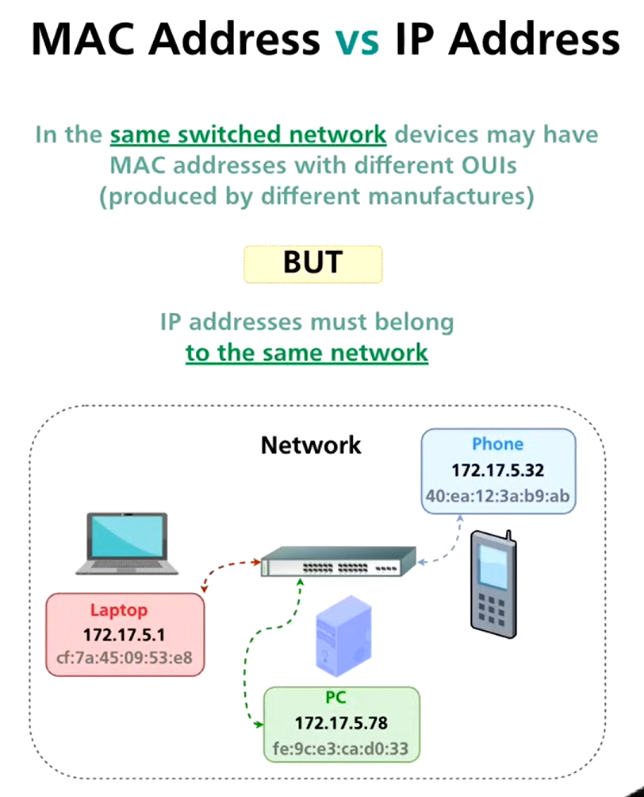

# Network layer

# ***Network Layer (OSI Layer 3) – Detailed Notes***

---

## 1️⃣ Disadvantages of Switched Networks in Large Networks



Switched networks work efficiently at **Layer 2**, but they do not scale well for large networks.

### 1.1 Broadcast Storm

- **Broadcast traffic** is forwarded to all devices in a broadcast domain.
- In large switched networks:
    - ARP requests
    - DHCP discovery
    - Unknown destination flooding
- Excessive broadcast traffic can:
    - Consume bandwidth
    - Increase CPU usage on hosts
    - Cause **network slowdown or complete failure** (broadcast storm)

📌 Switches **cannot stop broadcasts** by default.

---

### 1.2 Large MAC Address Tables

- Switches store MAC addresses in **CAM tables**.
- In large networks:
    - Thousands of devices → massive MAC tables
    - Higher memory usage
    - Slower lookups
- MAC tables are:
    - **Dynamic** (entries age out)
    - **Flat** (no hierarchy)

📌 Layer 2 lacks logical structure → poor scalability.

---

## 2️⃣ Introduction to the Network Layer

### Purpose of Network Layer

- Provides **logical addressing** (IP addresses)
- Enables **inter-network communication** (LAN to LAN)
- Determines **best path** for packet delivery

Key responsibilities:

- Logical addressing
- Routing
- Packet forwarding
- Fragmentation (if required)

---

## 3️⃣ What is an IP Address (Deep Dive)



### Definition

An **IP address** is a **logical, hierarchical identifier** assigned to a device on a network.

### Why IP Addresses Are Needed

- MAC addresses:
    - Work only inside a LAN
    - Are flat and non-routable
- IP addresses:
    - Identify **network + host**
    - Allow routing across networks

📌 IP = logical location, MAC = physical identity

---

## 4️⃣ IPv4 vs IPv6

| Feature | IPv4 | IPv6 |
| --- | --- | --- |
| Address size | 32-bit | 128-bit |
| Format | Decimal | Hexadecimal |
| Address space | ~4.3 billion | Extremely large |
| Broadcast | Supported | Not supported |
| NAT required | Yes | No |
| Security | Optional | Built-in IPsec |

---

## 5️⃣ IPv4 Address Format


- 32 bits divided into **4 octets**
- Each octet = 8 bits

Example:

```
192.168.1.10

```

Binary example:

```
11000000.10101000.00000001.00001010

```

---

## 6️⃣ IPv4 Address Range

- Each octet range: **0–255**
- Total addresses: **2³² = 4,294,967,296**

Special ranges:

- 0.0.0.0 → unspecified
- 127.0.0.0/8 → loopback
- 255.255.255.255 → broadcast

---

## 7️⃣ MAC Address vs IP Address



| MAC Address | IP Address |
| --- | --- |
| Physical | Logical |
| Layer 2 | Layer 3 |
| Fixed (mostly) | Changeable |
| Flat | Hierarchical |
| Used in LAN | Used across networks |

📌 ARP links MAC and IP addresses together.

---

## 8️⃣ Types of IP Addresses


### 8.1 Unicast IP Address

- Identifies **one device**
- Most common communication type

### 8.2 Broadcast IP Address (IPv4 only)

- Sends to **all hosts in a network**
- Example: 192.168.1.255

### 8.3 Multicast IP Address

- Sends to **selected group** of devices
- Range: **224.0.0.0 – 239.255.255.255**

---

## 9️⃣ Router – Deep Dive


### What is a Router?

A router is a **Layer 3 device** that connects **multiple networks** and forwards packets based on **IP addresses**.

---

### Router Operation by OSI Layers

### Physical Layer

- Uses cables, fiber, or wireless
- Transmits raw bits

### Data Link Layer

- Encapsulates packets into frames
- Uses **MAC addresses per hop**
- Each interface has its own MAC

### Network Layer

- Examines **destination IP address**
- Chooses best route
- Decrements TTL
- Forwards packet

---

## 10. Routing Protocols

Routing protocols help routers **learn paths automatically**.

Examples:

- RIP (distance-vector)
- OSPF (link-state)
- EIGRP (hybrid)
- BGP (inter-domain routing)

📌 Without routing protocols, routes must be **manually configured**.

---

## 11. LAN vs WAN

| LAN | WAN |
| --- | --- |
| Small area | Large geographic area |
| High speed | Lower speed |
| Ethernet/Wi-Fi | MPLS, leased lines |
| Low latency | Higher latency |

---

## 12️⃣ How Routers Interconnect Multiple LANs


- Each LAN has a **unique IP network**
- Router connects using **multiple interfaces**
- Each interface belongs to a different subnet

Example:

- LAN 1: 192.168.1.0/24
- LAN 2: 192.168.2.0/24

Router:

- Interface 1 → 192.168.1.1
- Interface 2 → 192.168.2.1

📌 Router enables communication **between broadcast domains** and **controls broadcast traffic**.

---

## ✅ Summary

- Switched networks fail to scale due to broadcasts and MAC table size
- Network Layer introduces **logical addressing and routing**
- IP addresses enable communication across networks
- Routers operate at multiple OSI layers
- Routing protocols automate path discovery
- Routers connect and isolate LANs effectively