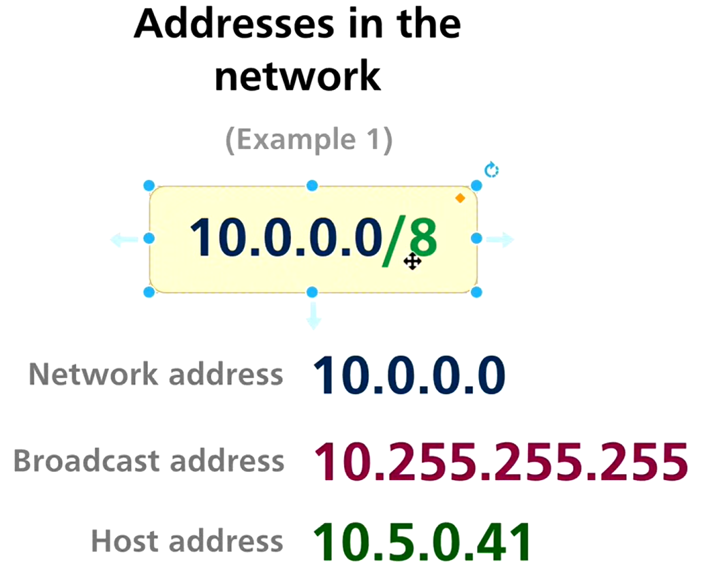

# 5.Networks and Binary Math

Status: Done

# ***Networks and Addresses + Binary Math – Revision Notes***

---

## 1️⃣ Networks with Addresses



In IP networking, every subnet contains **three important types of addresses**:

1. Network Address
2. Broadcast Address
3. Host Addresses

---

### 1.1 Network Address

- Identifies the **network itself**
- First address in the subnet
- All **host bits are 0**
- **Cannot be assigned to a host**

Example:

- IP: 192.168.1.10/24
- Network Address: **192.168.1.0**

---

### 1.2 Broadcast Address

- Used to send data to **all hosts in the network**
- Last address in the subnet
- All **host bits are 1**
- **Cannot be assigned to a host**

Example:

- Broadcast Address: **192.168.1.255**

---

### 1.3 Host Addresses

- Valid addresses that can be assigned to devices
- Range between network and broadcast address

Example:

- Host range: **192.168.1.1 – 192.168.1.254**

---

## 2️⃣ Examples of Networks

### Example 1

- Network: 192.168.10.0/24
- Network Address: 192.168.10.0
- Broadcast Address: 192.168.10.255
- Host Range: 192.168.10.1 – 192.168.10.254

---

### Example 2

- Network: 10.0.0.0/8
- Network Address: 10.0.0.0
- Broadcast Address: 10.255.255.255
- Host Range: 10.0.0.1 – 10.255.255.254

---

### Example 3

- Network: 172.16.5.0/16
- Network Address: 172.16.0.0
- Broadcast Address: 172.16.255.255
- Host Range: 172.16.0.1 – 172.16.255.254

---

## 3️⃣ Binary Math – Decimal to Binary

### Method

- Divide the decimal number by **2** repeatedly
- Write remainders from **bottom to top**

### Example: Decimal 13 → Binary

| Division | Result | Remainder |
| --- | --- | --- |
| 13 ÷ 2 | 6 | 1 |
| 6 ÷ 2 | 3 | 0 |
| 3 ÷ 2 | 1 | 1 |
| 1 ÷ 2 | 0 | 1 |

Binary: **1101**

---

## 4️⃣ Binary Math – Binary to Decimal

### Method

- Multiply each bit by **2ⁿ**, starting from right

### Example: Binary 1011 → Decimal

```
1×2³ + 0×2² + 1×2¹ + 1×2⁰
= 8 + 0 + 2 + 1
= 11

```

---

## 5️⃣ Logical Operators in Binary Math

Logical operators are used heavily in **subnetting and routing**.

---

### 5.1 AND Operator (&)

- Result is **1 only if both bits are 1**

| Bit 1 | Bit 2 | Result |
| --- | --- | --- |
| 0 | 0 | 0 |
| 0 | 1 | 0 |
| 1 | 0 | 0 |
| 1 | 1 | 1 |

### Example

```
1100
AND 1010
----
1000

```

📌 Used to find **network address** (IP AND subnet mask)

---

### 5.2 OR Operator (|)

- Result is **1 if any bit is 1**

| Bit 1 | Bit 2 | Result |
| --- | --- | --- |
| 0 | 0 | 0 |
| 0 | 1 | 1 |
| 1 | 0 | 1 |
| 1 | 1 | 1 |

### Example

```
1001
OR  0101
----
1101

```

📌 Used conceptually for **broadcast address creation**

---

## ✅ Summary

- Every network has **network, broadcast, and host addresses**
- Network address = all host bits 0
- Broadcast address = all host bits 1
- Binary math is essential for subnetting
- AND operator finds network portion
- OR operator helps derive broadcast address

---