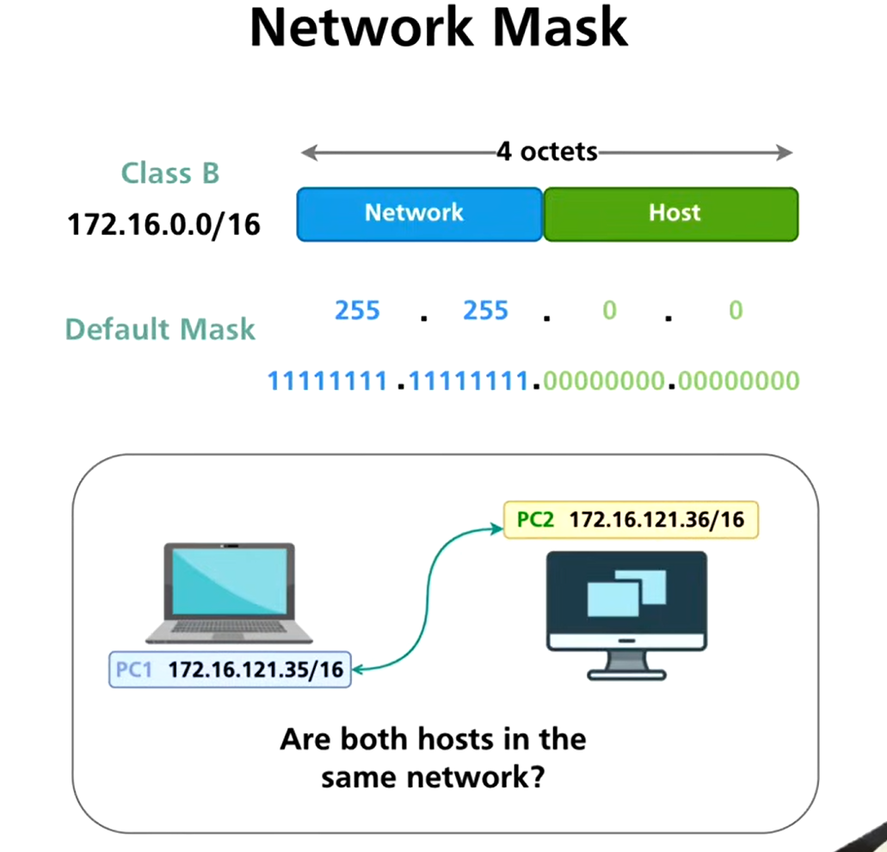
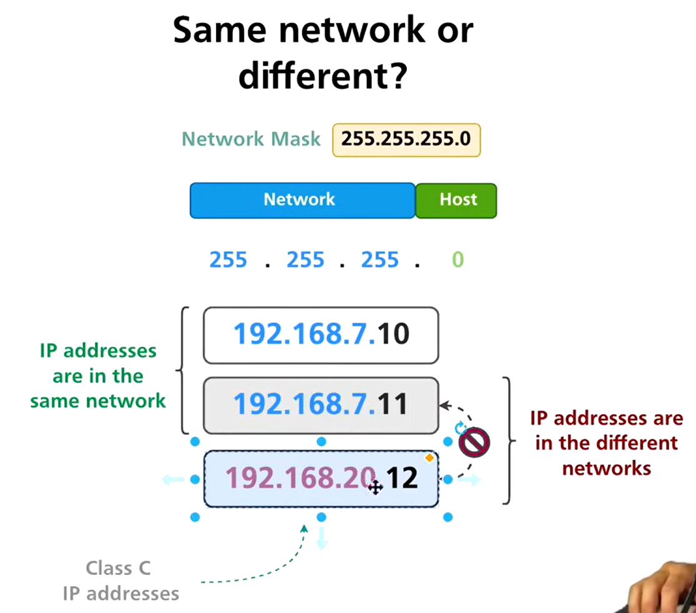
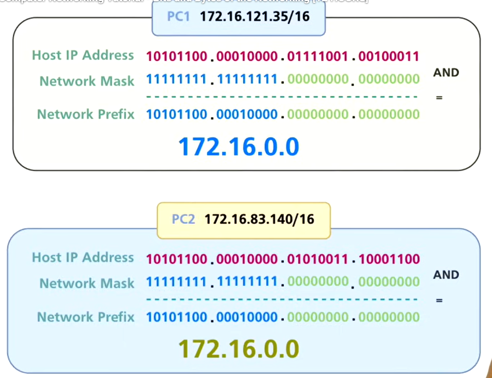
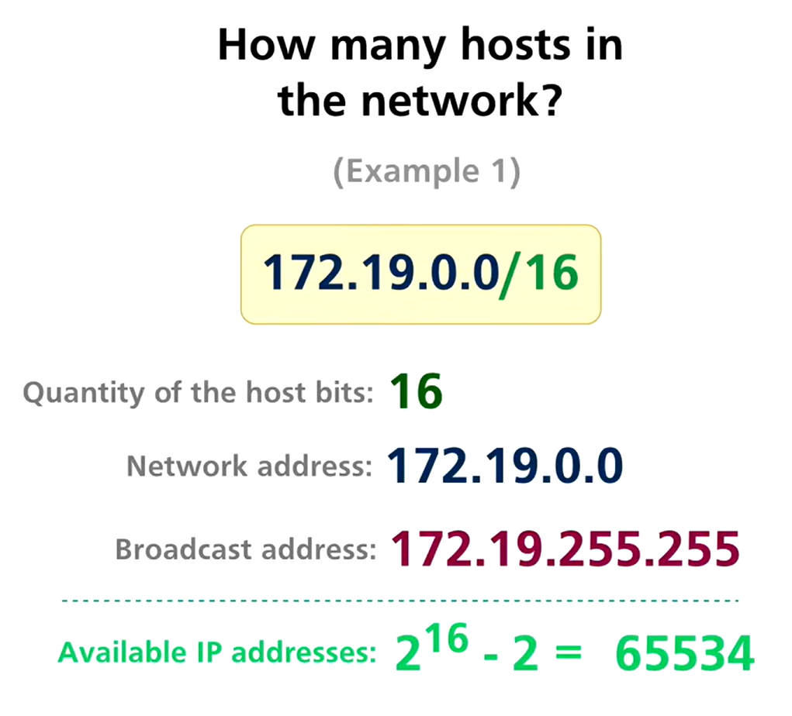
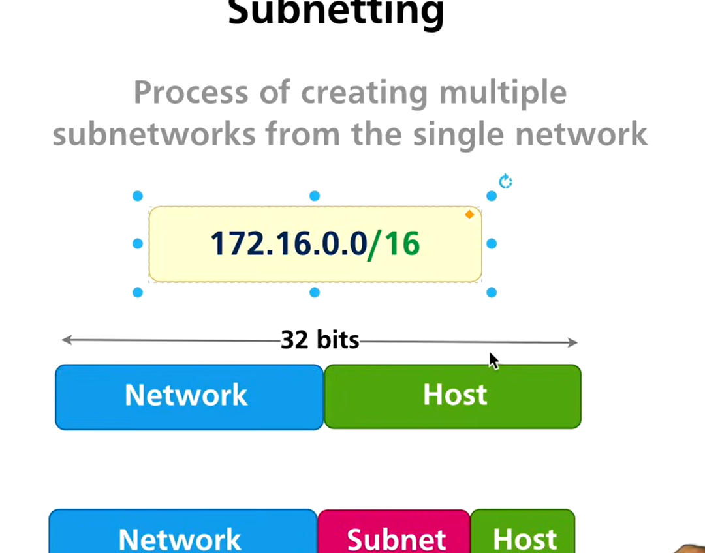
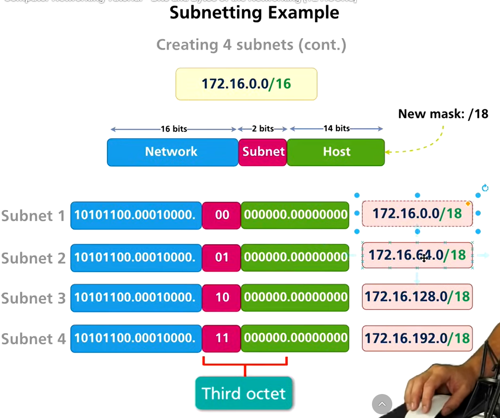
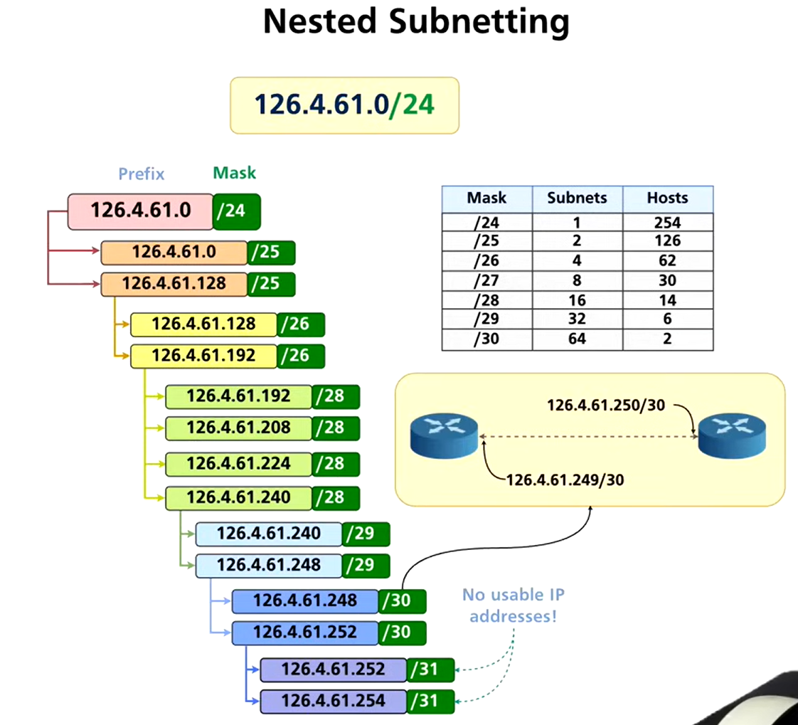

# 6.Network masks and Subnetting

Status: Done

# 

# ***Network Masks***



---

## 1️⃣ What is a Network Mask?

- A **network mask** (also called subnet mask) is a 32-bit number that divides an IP address into:
    - **Network portion** (1s)
    - **Host portion** (0s)
- It determines which addresses belong to the same network and how many hosts a network can have.

### Example: 172.16.0.0/16

- Network bits: 16
- Host bits: 16
- Binary mask: `11111111.11111111.00000000.00000000`
- Network portion: 172.16
- Host portion: 0.0–255.255

---

## 2️⃣ Default Masks (Classful Networking)

| Class | Default Mask | CIDR |
| --- | --- | --- |
| A | 255.0.0.0 | /8 |
| B | 255.255.0.0 | /16 |
| C | 255.255.255.0 | /24 |

---

## 3️⃣ Checking if Two IPs are in the Same Network (Binary AND Method)





**Rule:**

```
Network Address = IP Address AND Subnet Mask

```

If both IPs produce the same network address → same network.

### Example 1 – Easy

- IP 1: 192.168.1.10
- IP 2: 192.168.1.50
- Mask: /24 → 255.255.255.0

**AND Operation (last octet):**

```
10  = 00001010
50  = 00110010
Mask = 11111111
AND Result = 00001010 → Network 192.168.1.0

```

✅ Same network

### Example 2 – Intermediate

- IP 1: 172.19.5.10
- IP 2: 172.19.200.5
- Mask: /16 → 255.255.0.0

**AND Operation (3rd octet):**

```
5   = 00000101
200 = 11001000
Mask= 00000000
AND Result = 00000000 → Network 172.19.0.0

```

✅ Same network

### Example 3 – Hard

- IP 1: 19.125.31.130
- IP 2: 19.125.31.200
- Mask: /27 → 255.255.255.224

**AND Operation (last octet):**

```
130 = 10000010
200 = 11001000
Mask= 11100000
AND Result 130 → 128, 200 → 192

```

❌ Different networks

---

## 4️⃣ Calculating Number of Hosts in a Network



**Formula:**

```
Number of hosts = 2^(host bits) - 2

```

(-2 accounts for network & broadcast addresses)

### Examples

1. **172.19.0.0/16**
- Host bits = 32 − 16 = 16
- Hosts = 2^16 − 2 = 65,534
- Network = 172.19.0.0
- Broadcast = 172.19.255.255
1. **130.18.31.0/24**
- Host bits = 32 − 24 = 8
- Hosts = 2^8 − 2 = 254
- Network = 130.18.31.0
- Broadcast = 130.18.31.255
1. **19.125.31.128/27**
- Host bits = 32 − 27 = 5
- Hosts = 2^5 − 2 = 30
- Network = 19.125.31.128
- Broadcast = 19.125.31.159 (calculated using binary method)
- Valid host range = 19.125.31.129 – 19.125.31.158

---

## ✅ Summary

- Network mask = separates **network** and **host** portions
- Binary AND helps check if IPs are in the same network
- Number of hosts = `2^(host bits) - 2`
- Broadcast address = all host bits set to 1
- Binary method required for **non-standard subnets** (/27, /28, etc.)

---

# ***Subnetting***

---

## 1️⃣ What is Subnetting?



**Definition:**

- Subnetting is the process of **dividing a larger network into smaller sub-networks (subnets)**.
- It allows better **network management, security, and efficient IP usage**.

### Example: IP 172.16.0.0/16

- Original network: 172.16.0.0/16 → 65,534 hosts
- Large number of hosts in a single network can cause:
    - Broadcast storms
    - Difficult management
- Subnetting divides it into smaller, manageable networks.

---

## 2️⃣ Why We Should Subnet

1. Reduce **broadcast traffic**
2. Improve **network security**
3. Efficient use of **IP addresses**
4. Simplify **routing tables**
5. Separate **departments or services** within an organization

---

## 3️⃣ Subnetting Example – Step by Step



### Original Network

- IP: 172.16.0.0/16
- Binary representation of last two octets (host bits): `00000000.00000000`
- 16 host bits available

### Step 1: Decide how many subnets

- Suppose we need 4 subnets
- Use formula:

```
Number of subnets = 2^n

```

Where **n = number of bits borrowed from host portion** for subnetting

### Step 2: Calculate borrowed bits

- 2 bits borrowed → 2^2 = 4 subnets
- 4 bits borrowed → 2^4 = 16 subnets

### Step 3: Calculate new subnet mask

- Original mask /16 → 255.255.0.0
- Borrow 2 bits → /18 → 255.255.192.0
- Borrow 4 bits → /20 → 255.255.240.0

### Step 4: Determine subnet ranges (using binary)

- **2 bits borrowed (/18)**:
    - Network increment = 2^(host bits)
    - Host bits = 14 → Increment = 2^14 = 16,384 addresses per subnet
    - Subnet ranges:
        - 172.16.0.0/18
        - 172.16.64.0/18
        - 172.16.128.0/18
        - 172.16.192.0/18
- **4 bits borrowed (/20)**:
    - Host bits = 12 → 2^12 = 4,096 addresses per subnet
    - Subnet ranges:
        - 172.16.0.0/20
        - 172.16.16.0/20
        - 172.16.32.0/20 … up to 16 subnets

---

## 4️⃣ Nested Subnetting



**Definition:**

- Subnetting a subnet further to create smaller subnets
- Useful for hierarchical network design

### Example: IP 126.4.61.0/24

- Original subnet: /24 → 256 addresses (254 hosts)
- Suppose we need 4 smaller subnets
- Borrow 2 bits from host portion:

```
New subnet mask: /26 → 255.255.255.192

```

- Host bits left = 6 → 2^6 - 2 = 62 hosts per subnet
- Subnet ranges:
    - 126.4.61.0/26 → Hosts 126.4.61.1–62
    - 126.4.61.64/26 → Hosts 126.4.61.65–126
    - 126.4.61.128/26 → Hosts 126.4.61.129–190
    - 126.4.61.192/26 → Hosts 126.4.61.193–254

---

## 5️⃣ Summary / Key Points

- **Subnetting** divides a large network into smaller networks
- Borrow **host bits** to create more subnets
- Formula: **Number of subnets = 2^n** (n = borrowed bits)
- New subnet mask = Original mask + borrowed bits
- **Nested subnetting** allows hierarchical subnet design
- Each subnet has its **network address, broadcast address, and valid host range**

---

---

## ***Binary Method for Broadcast Address***

### Step 1: Write the IP address and subnet mask in binary

- IP: 19.125.31.130 → `00010011.01111101.00011111.10000010`
- Mask: /27 → 255.255.255.224 → `11111111.11111111.11111111.11100000`

### Step 2: Identify network bits and host bits

- **Network bits** = bits set to 1 in subnet mask
- **Host bits** = bits set to 0 in subnet mask (these can change)

### Step 3: Set all host bits to 1

- Network portion stays the same
- Host portion = all 1s → this gives the **broadcast address**

```
Network bits: 10000000 (from IP AND mask)
Host bits:    00011111 → 11111
Broadcast last octet: 10011111 → 159

```

### Step 4: Combine all octets

- Broadcast address: **19.125.31.159**

---

### ✅ Key Points

- **Network bits** remain the same
- **Host bits** all 1s → broadcast
- Works for any subnet (/24, /27, /30, etc.)
- Easy to do visually in binary or with IP calculators

---