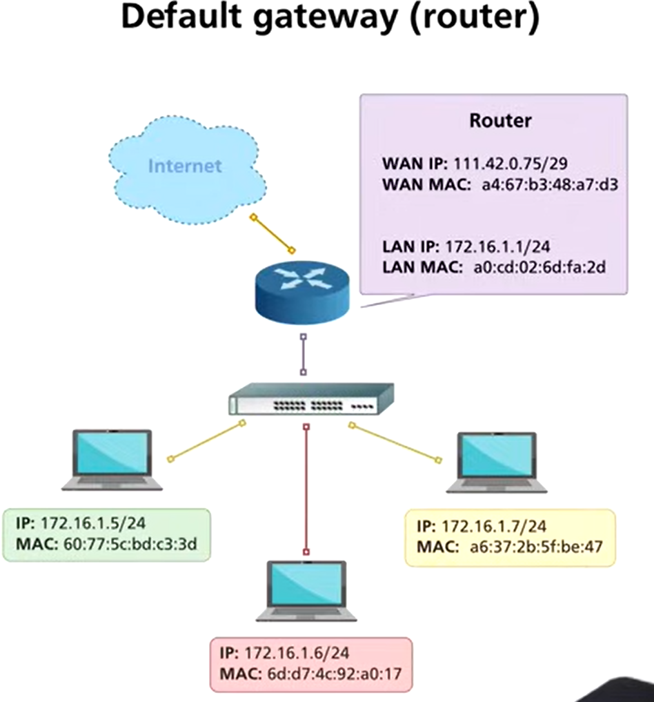
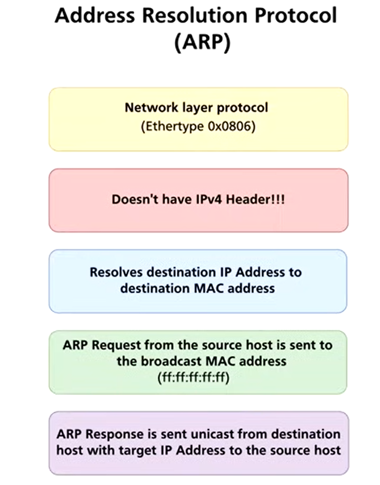
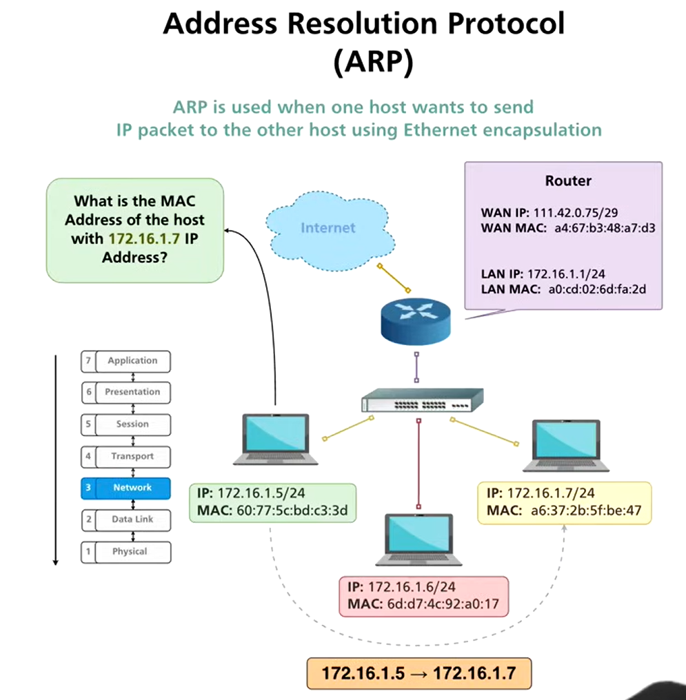
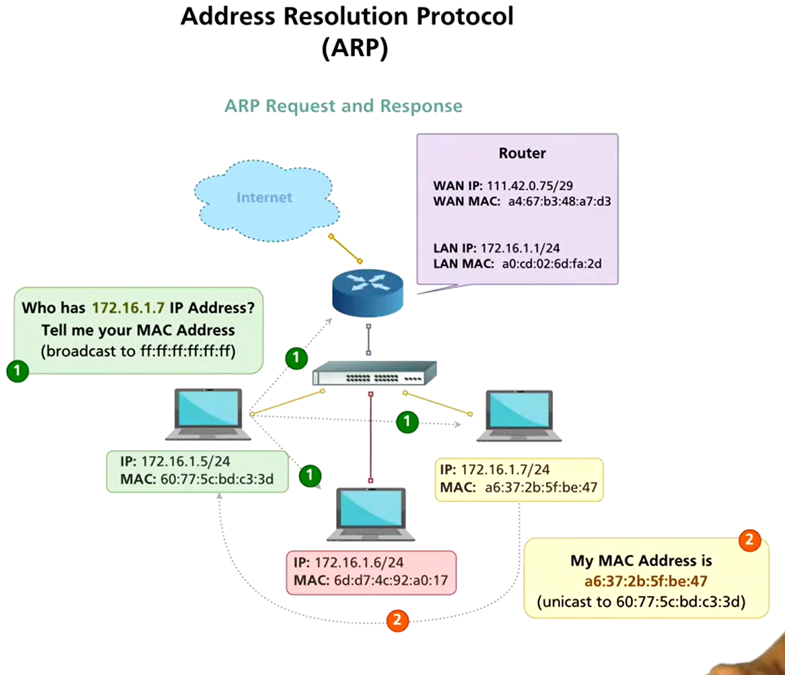
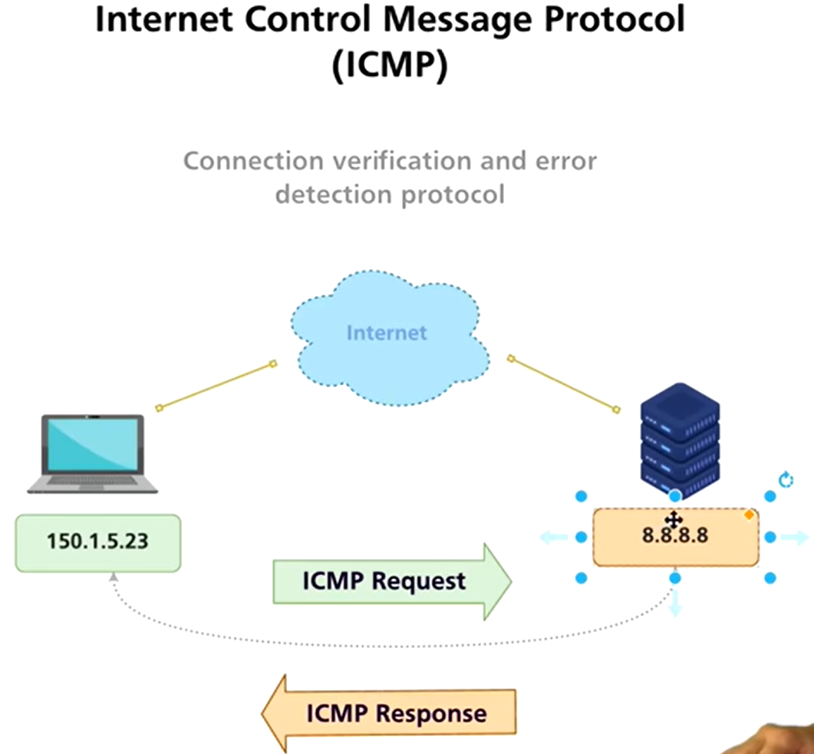

# 7.ARP & ICMP

Status: Done

# ***Default Gateway, ARP & ICMP – Detailed Notes***

---

## 1️⃣ Default Gateway

**Definition:**

- A **default gateway** is a router or device that forwards traffic from a local network to **other networks or the Internet**.

**Function:**

1. Host checks if destination IP is in the **same subnet**.
2. If yes → send directly using destination MAC.
3. If no → send to **default gateway MAC**, which then routes it further.

**Key point:** Without a default gateway, hosts cannot communicate outside their LAN.

---

## 2️⃣ ARP (Address Resolution Protocol)

### Purpose

- Resolves **IP addresses (Layer 3)** to **MAC addresses (Layer 2)**.
- Essential for sending frames on a LAN.

### Function & Ethertype

- **EtherType:** 0x0806 → indicates ARP in Ethernet frames.
- **IP header:** Contains sender and target IP addresses.
- ARP maps **IP ↔ MAC** so Ethernet frames can be correctly delivered.

### ARP Request & Response

1. **ARP Request:**
    - Broadcast frame → destination MAC = FF:FF:FF:FF:FF:FF
    - Message: `Who has <IP>? Tell <sender IP>`
2. **ARP Response:**
    - Unicast frame → destination MAC = requester MAC
    - Message: `<IP> is at <MAC>`

### ARP Cache

- Temporary table storing **IP ↔ MAC mappings**.
- Reduces repeated broadcasts.
- Commands:
    - Windows: `arp -a`
    - Linux/macOS: `arp -n`

### Wireshark ARP Analysis

- **ARP Request:** broadcast, shows source IP/MAC, target IP
- **ARP Reply:** unicast, shows target MAC response
- Helps verify network connectivity and detect spoofing attacks

---

## 3️⃣ Sending Packets via Default Gateway

**Scenario:** Host wants to communicate with 8.8.8.8

1. Host checks subnet: destination not in LAN → uses default gateway
2. Host looks up **gateway MAC via ARP**
3. Host sends Ethernet frame to **default gateway MAC**
4. Router forwards IP packet toward destination
5. At each LAN hop, **ARP resolves MAC addresses**

**Layer-wise Table:**

| Step | Layer 3 (IP) | Layer 2 (MAC) |
| --- | --- | --- |
| Check if destination in LAN | Destination IP | Host MAC or Gateway MAC |
| Send packet | IP packet to destination | Ethernet frame to MAC |

---

## 4️⃣ ICMP (Internet Control Message Protocol)

**Purpose:**

- Provides **error messages** and **diagnostics** for IP networks.
- Does **not carry data**, only control information.

**Common Types:**

| Type | Purpose |
| --- | --- |
| 0 | Echo Reply (ping response) |
| 3 | Destination Unreachable |
| 8 | Echo Request (ping) |
| 11 | TTL Exceeded (traceroute) |

**How it works:**

- Ping → sends ICMP Echo Request → target replies with Echo Reply
- TTL exceeded → informs sender of dropped packet
- Encapsulated in IP packets, travels across networks

**ICMP in Wireshark:**

- Filter: `icmp`
- Shows source/destination, type/code, sequence number, and TTL

---

## ✅ Key Points

- **Default Gateway:** exit point for packets leaving LAN
- **ARP:** resolves IP to MAC, Ethertype = 0x0806, stored in ARP cache
- **ARP in Wireshark:** request = broadcast, reply = unicast
- **Packet flow:** remote packets → default gateway → resolved MAC addresses
- **ICMP:** diagnostics and error messages for IP networks

---

**Tip:** Understanding ARP + default gateway is critical for network troubleshooting and bug bounty network reconnaissance.