# 8.Transport Layer (TCP/UDP)

Status: Done

# ***Transport Layer (Layer 4)***

## Introduction to the Transport Layer

The Transport Layer is responsible for **end-to-end, process-to-process communication** between applications running on different hosts.

Layer-wise view:

- Physical Layer → Bits
- Data Link Layer → Frames (MAC)
- Network Layer → Packets (IP)
- Transport Layer → Segments / Datagrams (Ports)

The transport layer ensures that data reaches the **correct application** using **port numbers**.

---

## Transport Layer and Application Protocols

The transport layer supports application layer protocols but does not interpret their contents.

Common application protocols relying on the transport layer:

- HTTP – Web communication
- HTTPS – Secure web communication
- SSH – Secure remote access
- IMAP – Email retrieval
- SMTP – Email transmission

All these protocols primarily use **TCP** for reliable communication.

---

## Client–Server Model

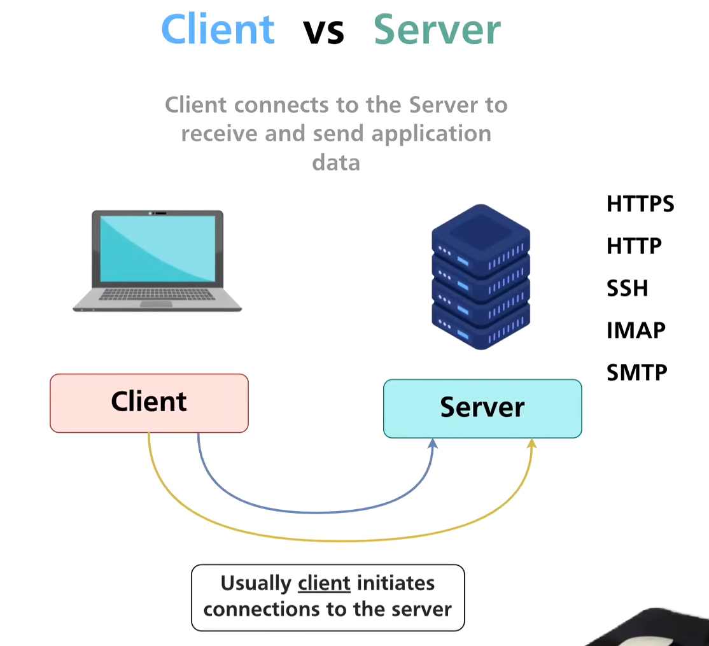

### Client

- Initiates communication
- Requests services
- Uses temporary (ephemeral) source ports

### Server

- Provides services
- Listens on well-known ports
- Responds to client requests

### Data Exchange Process

1. Client sends data to server IP and server port
2. Server processes the request
3. Server replies to client IP and client port

---

## Ports and Transport Layer Connectivity

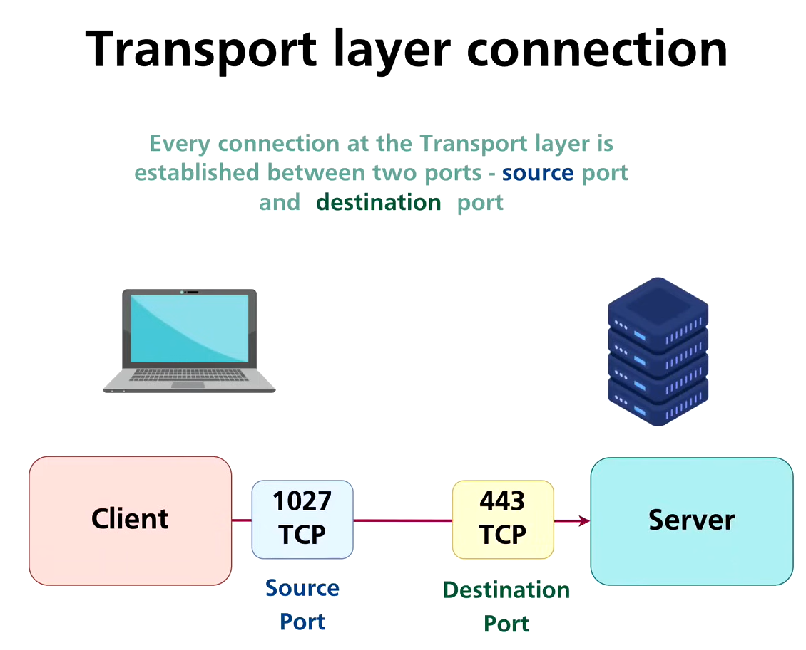

### What are Ports?

Ports are logical identifiers used by the transport layer to distinguish between multiple applications on the same host.

- IP address identifies the host
- Port number identifies the application

### Port Size

- 16 bits
- Range: 0–65535

---

## Application Protocol Port Numbers

| Protocol | Port |
| --- | --- |
| HTTP | 80 |
| HTTPS | 443 |
| SSH | 22 |
| IMAPS | 993 |
| SMTPS | 465 / 587 |

Servers listen on these ports by default.

---

## Multiplexing and Demultiplexing

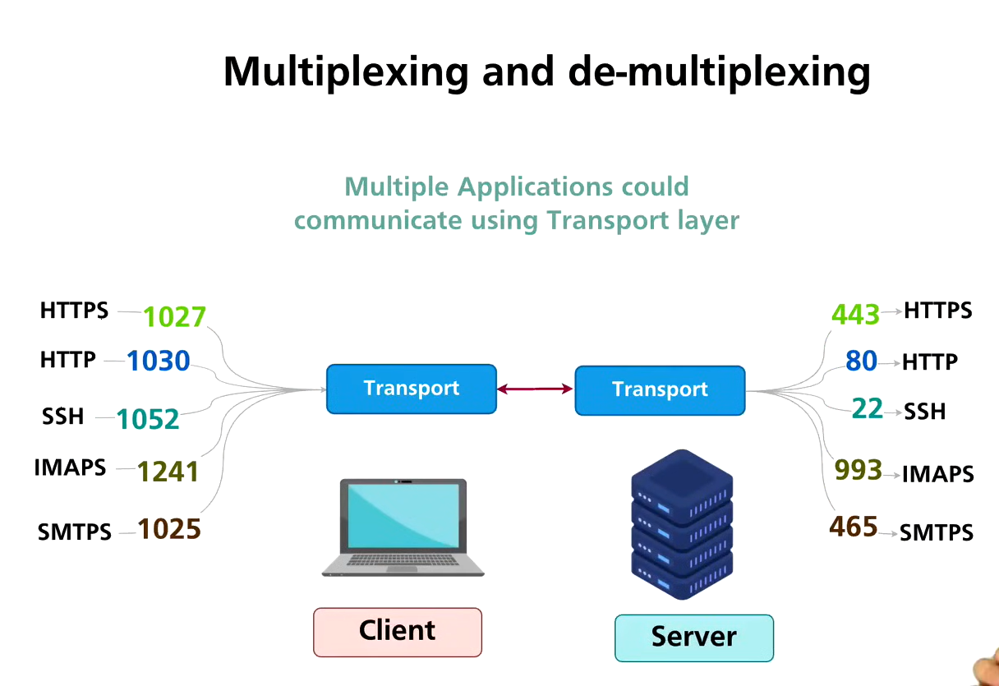

### Multiplexing

- Occurs at sender side
- Multiple applications send data simultaneously
- Transport layer adds source and destination ports

### Demultiplexing

- Occurs at receiver side
- Transport layer examines destination port
- Delivers data to the correct application

---

## Client Connection to Server (Source and Destination Ports)

### Source Port

- Chosen dynamically by client OS
- Temporary (ephemeral)
- Identifies the client application

### Destination Port

- Fixed and well-known
- Identifies the server application

### Example

Client: 192.168.1.10:53214

Server: 142.250.77.14:443

---

## Port Ranges (IANA)

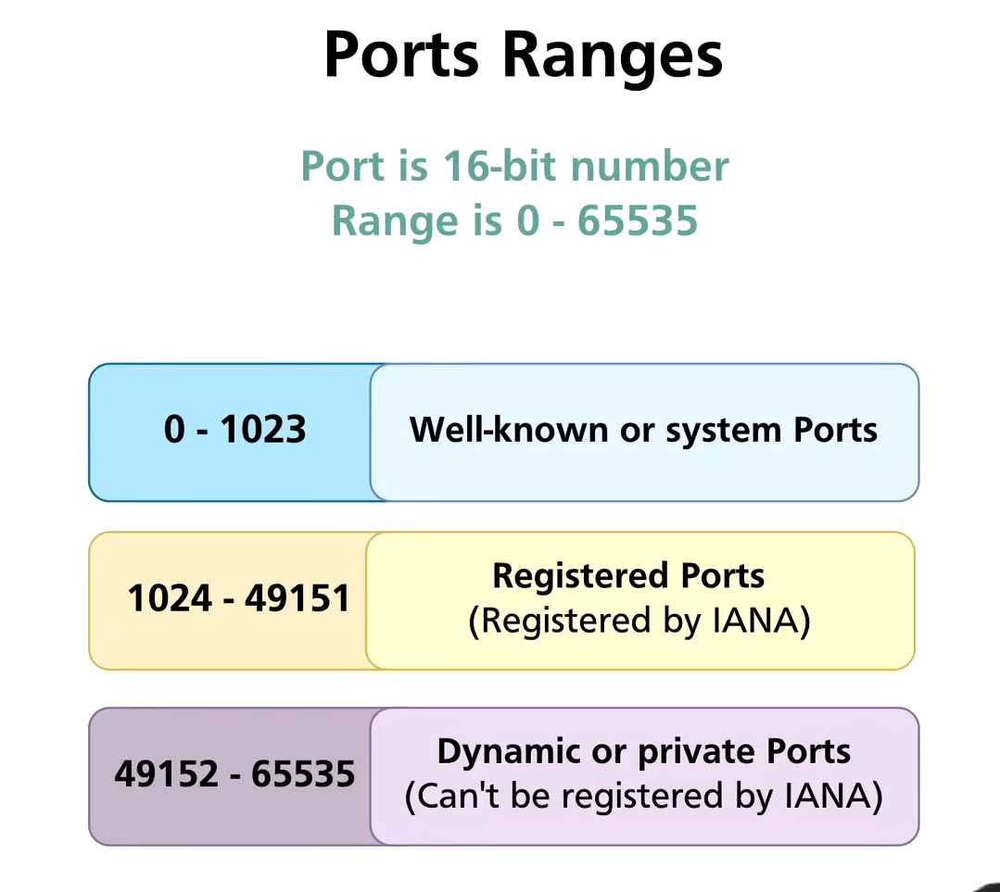

| Range | Purpose |
| --- | --- |
| 0–1023 | Well-known ports |
| 1024–49151 | Registered ports |
| 49152–65535 | Dynamic / Ephemeral ports |

---

## Network Socket

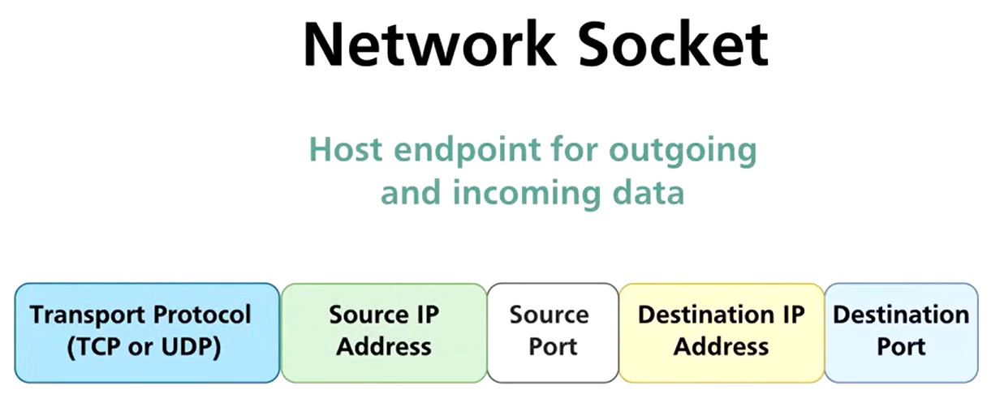

### Definition

A network socket uniquely identifies a communication endpoint between two applications.

### Socket 5-Tuple

A socket consists of:

1. Source IP address
2. Source port number
3. Destination IP address
4. Destination port number
5. Transport protocol (TCP or UDP)

### Example Socket

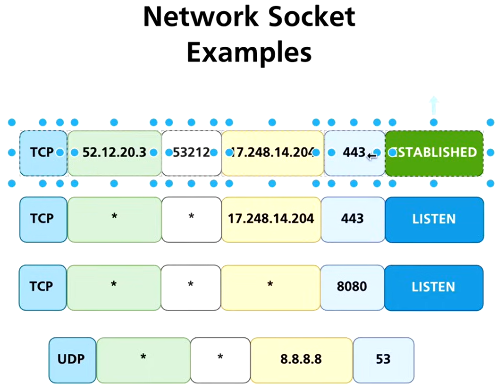

TCP 192.168.1.10:53214 → 142.250.77.14:443

---

## Wildcard Sockets

### What is a Wildcard Socket?

A wildcard socket listens on all network interfaces of a host.

### Example

0.0.0.0:80

This allows a server to accept connections on any IP address assigned to the machine.

---

## Multiple Sockets and Wildcard Usage

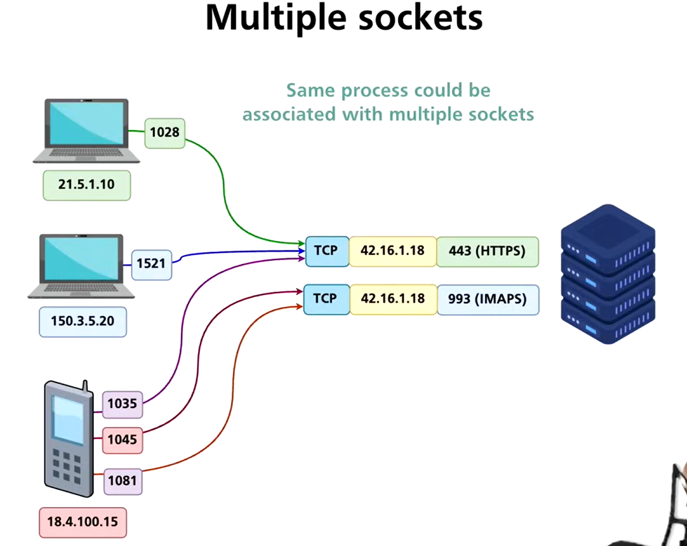

- A server can handle many clients using the same destination port
- Each client connection creates a unique socket
- Uniqueness is maintained using source IP and source port

---

## Same Port in Different Applications

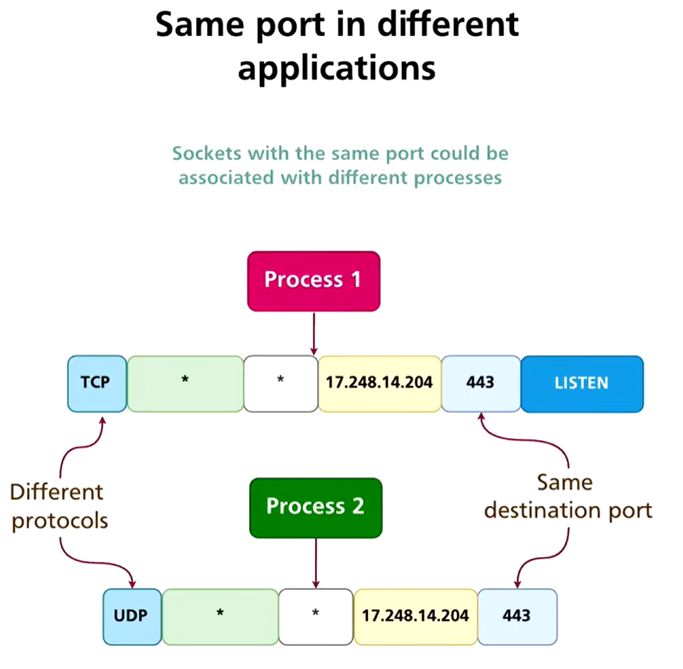

- Same port number can exist on different IP addresses
- Same port number can be used independently by TCP and UDP

Example:

- TCP port 80 → HTTP
- UDP port 80 → Separate application

---

## Analyzing Sockets Using Netstat

### Windows (PowerShell / CMD)

netstat -an

### Linux

netstat -anp

### Common Options

- a → Show all connections
- n → Display numeric addresses
- p → Show process using the socket

---

## TCP vs UDP in Netstat Output

### TCP

- Connection-oriented
- Shows states such as LISTEN, ESTABLISHED, TIME_WAIT

### UDP

- Connectionless
- No connection states
- Displays active or listening endpoints only

---

## Key Points

- Transport layer enables application-level communication
- Ports allow multiplexing of applications
- Sockets uniquely identify connections
- Netstat is essential for troubleshooting and security analysis

# ***TCP & UDP***

---

## 1. TCP vs UDP (Detailed Comparison)

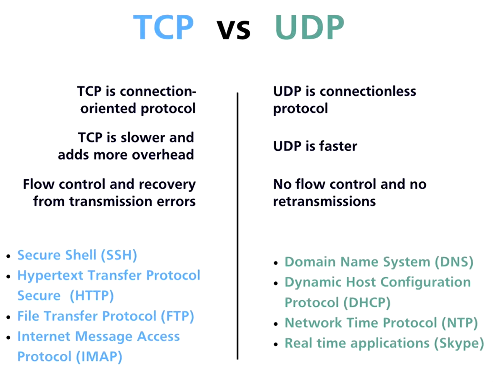

### TCP (Transmission Control Protocol)

- Connection-oriented
- Reliable delivery
- Ordered data transfer
- Error detection & recovery
- Flow control (Window size)
- Congestion control

**Used by:** HTTP/HTTPS, SSH, FTP, SMTP, IMAP

### UDP (User Datagram Protocol)

- Connectionless
- No reliability
- No ordering
- No congestion or flow control
- Very low overhead

**Used by:** DNS, VoIP, Streaming, DHCP, Gaming

---

## 2. TCP Three-Way Handshake (Connection Establishment)

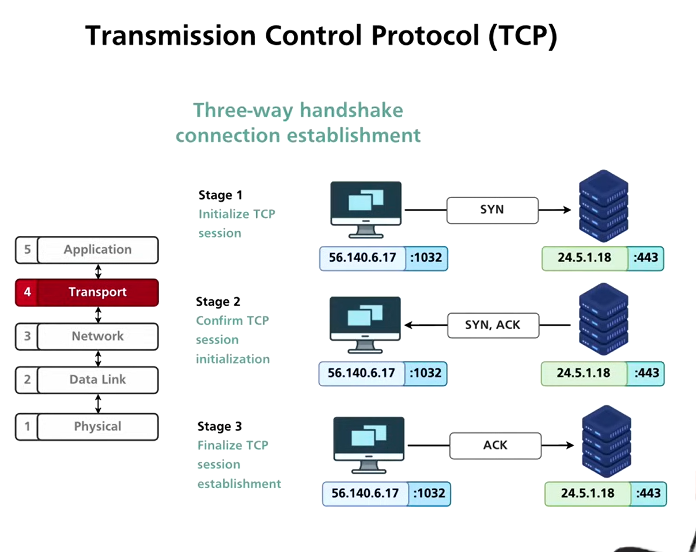

### Step 1: SYN

- Client sends SYN
- Initial Sequence Number (ISN)

### Step 2: SYN-ACK

- Server acknowledges client ISN
- Sends its own ISN

### Step 3: ACK

- Client acknowledges server ISN
- Connection established

**Purpose:**

- Synchronize sequence numbers
- Confirm bidirectional reachability

---

## 3. TCP Connection Teardown (Graceful Close)

### FIN-based termination

1. FIN → close request
2. ACK → acknowledgment
3. FIN → reverse close
4. ACK → final acknowledgment

**TIME_WAIT state prevents delayed packet issues**

### Abrupt Termination

- RST flag used

---

## 4. TCP Flags (Control Bits)

| Flag | Purpose |
| --- | --- |
| SYN | Start connection |
| ACK | Acknowledgment |
| FIN | Graceful close |
| RST | Reset connection |
| PSH | Push data immediately |
| URG | Urgent data |

---

## 5. TCP Header Structure (10 Core Components)

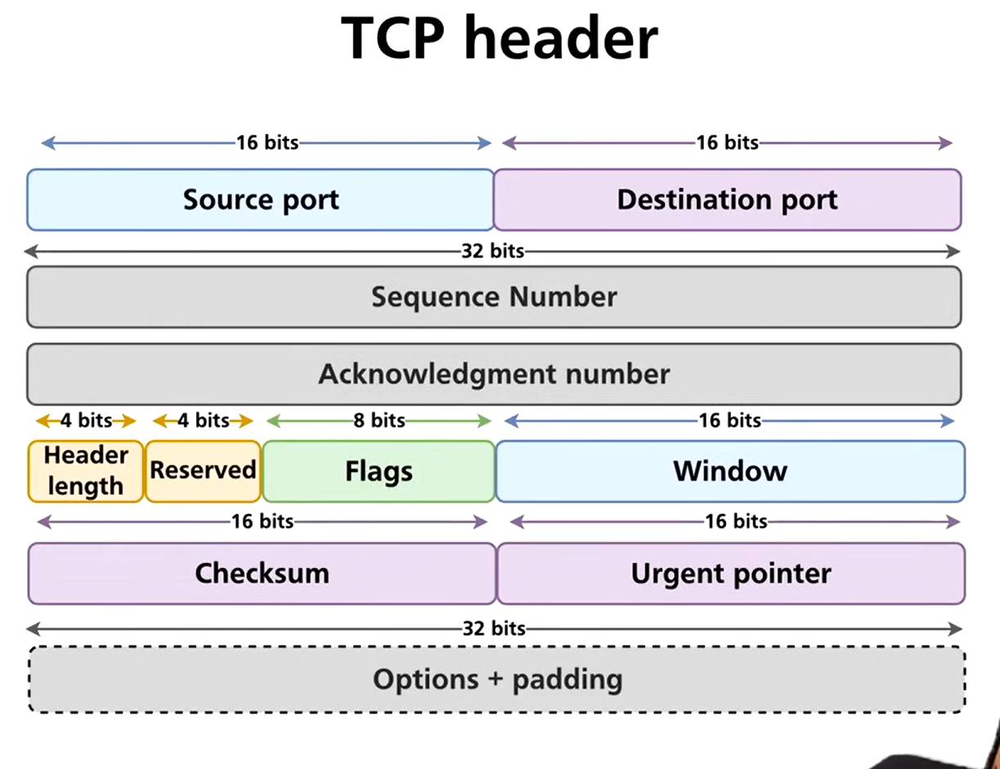

1. Source Port (16 bits)
2. Destination Port (16 bits)
3. Sequence Number (32 bits)
4. Acknowledgment Number (32 bits)
5. Data Offset (Header length)
6. Reserved bits
7. Flags (SYN, ACK, FIN, RST, etc.)
8. Window Size (Flow control)
9. Checksum (Error detection)
10. Urgent Pointer

*Options field may include MSS, SACK, timestamps*

---

## 6. TCP Analysis in Wireshark

### What to Observe

- SYN → SYN-ACK → ACK
- Sequence & acknowledgment numbers
- Window size changes
- Retransmissions
- FIN / RST behavior

### Useful Filters

- tcp
- tcp.flags.syn == 1
- tcp.stream eq X

---

## 7. UDP Protocol (Detailed)

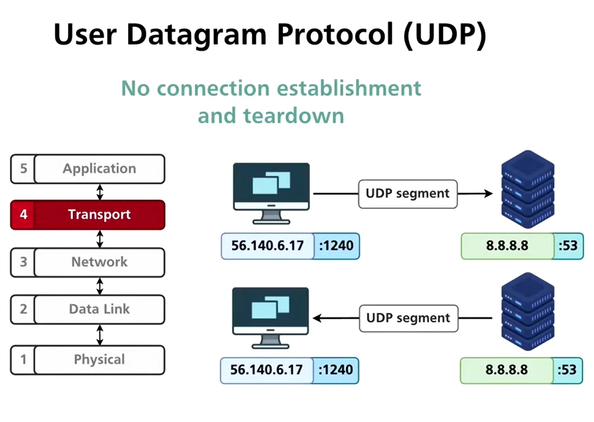

### UDP Characteristics

- No handshake
- No session state
- Independent datagrams

### UDP Header Structure (4 Fields)

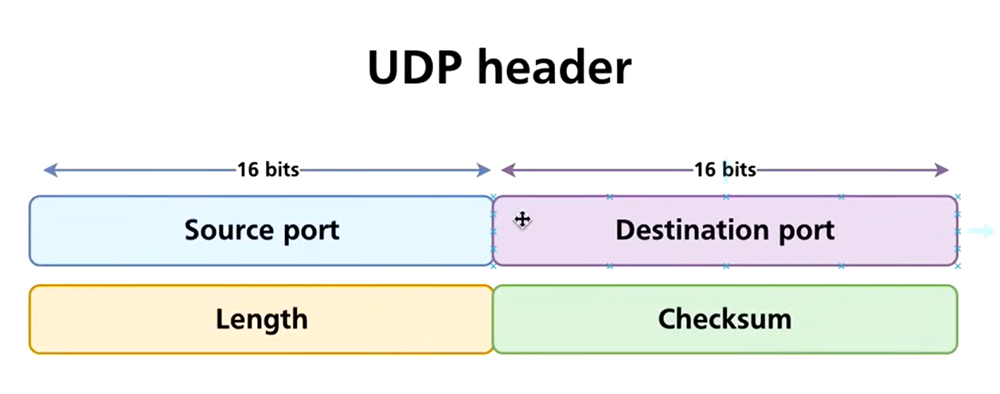

1. Source Port (16 bits)
2. Destination Port (16 bits)
3. Length (16 bits)
4. Checksum (16 bits)

---

## 8. Why UDP Analysis in Wireshark Is Limited

- No connection state
- No retransmissions
- No sequence numbers
- Each packet is independent

**Wireshark shows packets, not sessions**

---

## 9. Checksum & Error Detection

### CRC / FCS (Layer 2)

- Detects bit errors
- Calculated over entire Ethernet frame
- Not visible in Wireshark (NIC strips it)

### TCP Checksum

- Covers:
    - TCP header
    - Data
    - Pseudo-header (Source IP, Dest IP, Protocol)

### UDP Checksum

- Similar to TCP
- Optional in IPv4
- Mandatory in IPv6

---

## 10. Network Socket States (TCP)

| State | Meaning |
| --- | --- |
| LISTEN | Waiting for connection |
| SYN-SENT | Client sent SYN |
| SYN-RECEIVED | Server replied |
| ESTABLISHED | Data transfer |
| FIN-WAIT-1 | Closing initiated |
| FIN-WAIT-2 | Awaiting FIN |
| CLOSE-WAIT | Remote close |
| LAST-ACK | Final ACK |
| TIME-WAIT | Cleanup delay |
| CLOSED | No connection |

---

## 11. Summary

- TCP = reliable, stateful
- UDP = fast, stateless
- TCP analysis is critical for security
- UDP analysis is protocol-specific
- Socket states explain real-world behavior

---

##