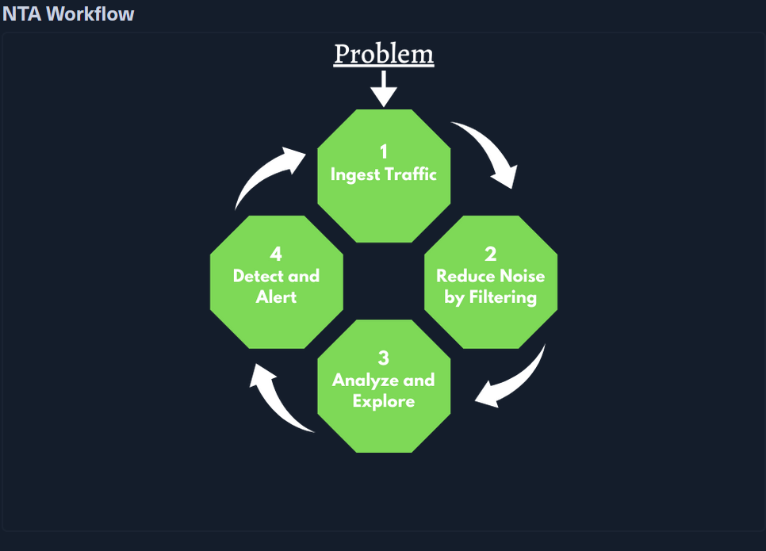

# intro to NTA

---

## ***Hack The Box – Network Traffic Analysis (NTA) Notes***

## 1. What is Network Traffic Analysis (NTA)

- **Definition:** Examining network traffic to understand ports, protocols, baseline behavior, detect threats, and gain visibility into an organization’s network.
- **Purpose:**
    - Detect anomalies and security threats early
    - Aid threat hunting and incident investigations
    - Ensure compliance with security guidelines
    - Identify attackers using legitimate credentials

**Everyday use cases:**

- Real-time traffic collection and threat analysis
- Setting baseline network communication
- Detecting traffic from unusual ports or suspicious hosts
- Identifying malware (ransomware, exploits, abnormal interactions)
- Investigating past incidents

**Example:**

- High volume of SYN packets on unusual ports → possible port scan.

---

## 2. Required Skills & Knowledge

### 2.1 Networking Fundamentals

- **TCP/IP Stack & OSI Model:** Understand interaction of traffic with host applications.
- **Basic Network Concepts:** Know the traffic seen at each layer (switching, routing, VLAN differences).

### 2.2 Protocols & Ports

- **Common Ports & Protocols:** Identify standard ports and how protocols communicate to detect malicious/malformed traffic.

### 2.3 Packets & Sublayers

- **TCP:** Stream-oriented, reliable, easy to follow conversations.
- **UDP:** Connectionless, faster, harder to reconstruct conversations.

### 2.4 Protocol Encapsulation

- Each layer encapsulates the previous.
- Ability to dissect headers helps in navigating packets efficiently.

### 2.5 Environment & Equipment

- **Tools and devices:** Capture, dissect, or analyze traffic.
- Focus for module: Wireshark, tcpdump.

---

## 3. Common Traffic Analysis Tools

| Tool | Description |
| --- | --- |
| **tcpdump** | CLI tool, uses LibPcap to capture/interprete packets from live interfaces or files |
| **Tshark** | CLI version of Wireshark; live capture or file decoding |
| **Wireshark** | GUI analyzer; captures frames, decodes protocols, detailed analysis |
| **NGrep** | Pattern-matching for network traffic; regex/BPF filtering |
| **tcpick** | CLI sniffer; tracks and reassembles TCP streams |
| **Network Taps** | Hardware to copy network traffic (inline or passive) |
| **SPAN Ports** | Port mirroring from switches/routers to capture traffic |
| **Elastic Stack** | Data ingestion, visualization, and search of traffic logs |
| **SIEMs** | Centralized analysis/alerting (e.g., Splunk) |

---

## 4. BPF (Berkeley Packet Filter) Syntax

- Provides a raw interface to Data-Link layer.
- Enables filtering and decoding packets across multiple tools (tcpdump, Wireshark, Tshark).
- Essential for narrowing down traffic for analysis.

---

## 5. Performing Network Traffic Analysis

### Passive vs Active

- Passive: Listen to traffic on the network segment.
- Active: Use taps, SPAN ports, or mirrored links to capture VLAN-specific traffic.

### Workflow Steps

1. **Ingest Traffic**
    - Capture traffic from network segment or link.
    - Use filters if targeting specific traffic.
2. **Reduce Noise by Filtering**
    - Remove unnecessary broadcast/multicast traffic.
    - Focus on hosts, protocols, and traffic of interest.
3. **Analyze & Explore**
    - Check for encryption, unauthorized access, unusual host communication.
    - Inspect TCP flags, protocols, and payloads.
4. **Detect & Alert**
    - Identify errors, failed connections, suspicious patterns.
    - Utilize IDS/IPS for automated detection.
5. **Fix & Monitor**
    - Implement fixes and continue monitoring for recurrence.
    - Not part of core loop but essential for effective NTA.

---

## 6. Key Takeaways

- Understanding **baseline network behavior** is critical for spotting anomalies.
- Tools like **Wireshark, tcpdump, NGrep, tcpick** are essential for hands-on NTA.
- Knowledge of **TCP/IP, OSI model, ports/protocols, packet structure, and BPF** enables efficient analysis.
- NTA workflow is **dynamic**: ingest → filter → analyze → detect → monitor.

---

I can also make a **visual workflow diagram and a cheat sheet for ports, protocols, and TCP flags** to make your notes more compact for labs and exams.

Do you want me to do that next?