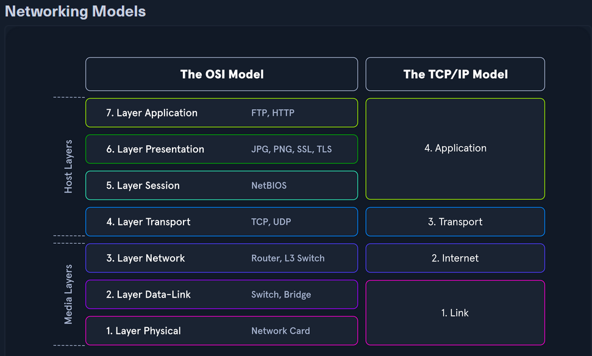
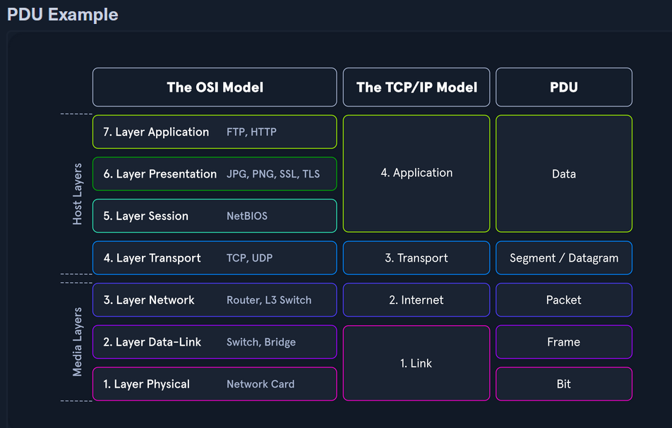
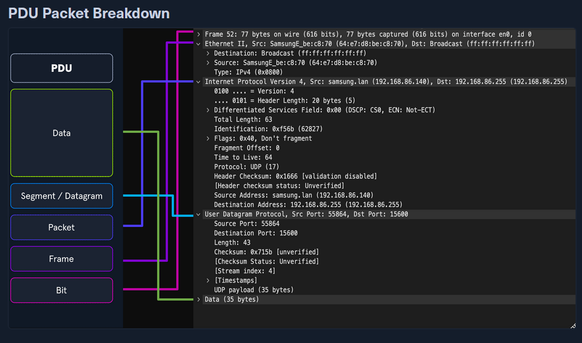
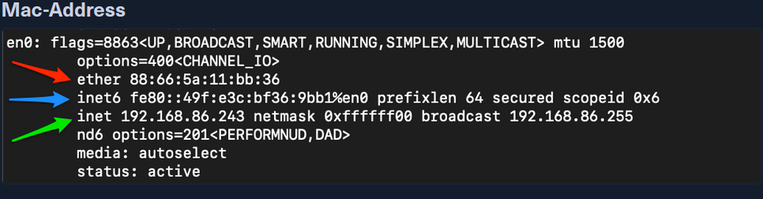
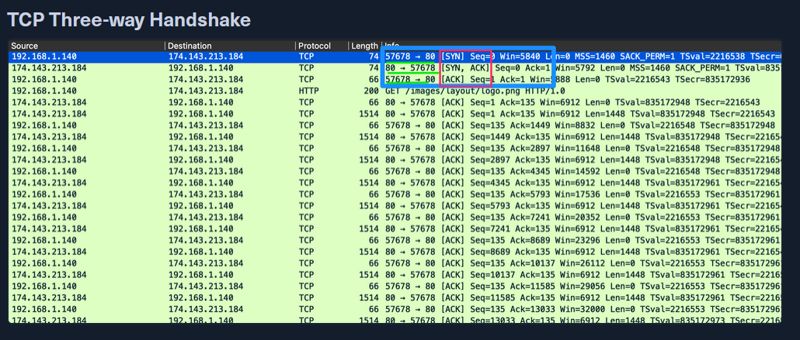
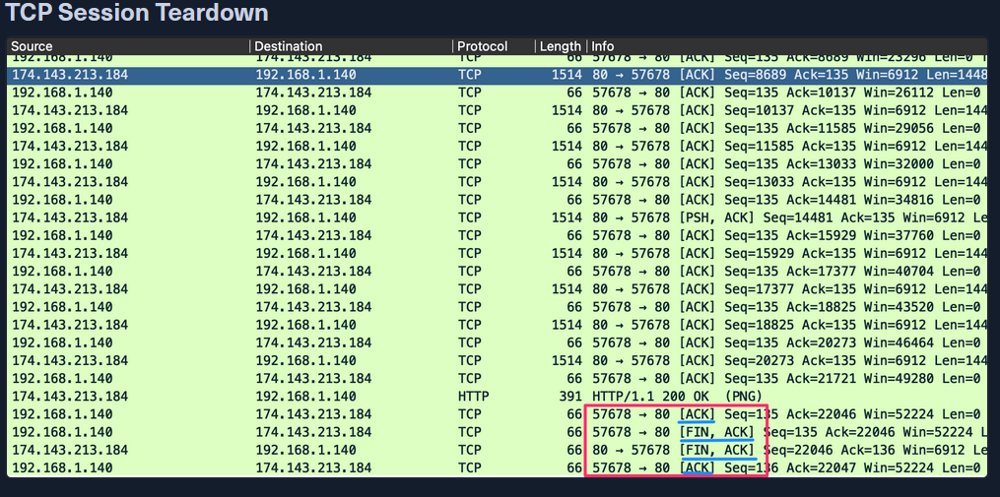

# Networking Primer 1-4

---

# Hack The Box – Networking Primer (Layers 1–4)

## 1. Purpose of Networking Knowledge in NTA

- Understanding network flow, ports, protocols is **essential for accurate traffic analysis**.
- Captured traffic cannot be properly analyzed without knowing **how data travels and is structured**.

---

## 2. Networking Models

### OSI vs TCP/IP

| Trait | OSI | TCP/IP |
| --- | --- | --- |
| Layers | 7 (Application, Presentation, Session, Transport, Network, Data-Link, Physical) | 4 (Application, Transport, Internet, Link) |
| Flexibility | Strict | Loose |
| Dependency | Protocol independent | Based on common protocols |
- **OSI Layers 1–4:** Focus on **data transportation** between hosts (physical medium, addressing, routing, TCP/UDP).
- **OSI Layers 5–7:** Focus on **data presentation and application handling**.
- TCP/IP merges OSI layers 5–7 into its Application layer.
- OSI is **theoretical**, TCP/IP is **practical and functional**.

### Protocol Data Units (PDU)

- Encapsulated data at each layer of OSI/TCP-IP.
- **Types:** Data → Segment/Datagram → Packet → Frame → Bit
- Encapsulation adds **headers** with control info: sequence numbers, IPs, ports, protocol info.
- **Wireshark displays PDUs in reverse** order (unwrapped from lower layers).
    
    
    

---

## 3. Addressing Mechanisms

### 3.1 MAC Addresses

- **Layer 2 (Data-Link):** Used for host-to-host communication within a broadcast domain.
- 48-bit (6 octets) hexadecimal format.
- Routers replace MAC info when forwarding traffic across networks.

### 3.2 IP Addresses

- **Layer 3 (Network/Internet):** Used for routing packets between networks.
- **Connectionless**: relies on TCP/UDP for reliability.

### IPv4

- 32-bit (4 octets) decimal format (0–255 per octet).
- Example: `192.168.86.243`
- Core addressing for most traffic today.

### IPv6

- 128-bit (16 octets) hexadecimal format.
- Solves IPv4 address exhaustion; supports **multicast, global addressing, IPSec, simplified headers**.
- Types of addresses:
    - **Unicast:** Single interface
    - **Anycast:** Multiple interfaces, first responder receives
    - **Multicast:** Multiple interfaces, all receive
    - **Broadcast:** Not used (replaced by multicast)
- Adoption ~40% globally.

---

## 4. Transport Layer – TCP & UDP

### 4.1 Comparison

| Characteristic | TCP | UDP |
| --- | --- | --- |
| Transmission | Connection-oriented | Connectionless (fire & forget) |
| Connection | 3-way handshake | None |
| Data Delivery | Stream-based | Packet-by-packet |
| Reliability | Sequence & ACK numbers | None |
| Speed | Slower (more overhead) | Fast but unreliable |
- **TCP:** Reliable, error-checked, ensures complete delivery (e.g., SSH, HTTP).
- **UDP:** Fast, no guarantees, suitable for streaming, DNS queries, or time-sensitive applications.

---

### 4.2 TCP Three-Way Handshake

**Purpose:** Establish a reliable session.

**Steps:**

1. **SYN:** Client initiates connection, sets sequence number.
2. **SYN/ACK:** Server acknowledges SYN, negotiates options.
3. **ACK:** Client confirms, connection established.

**Example in packet capture:**

- Client port: random high port (e.g., 57678)
- Server port: well-known service (e.g., 80 for HTTP)
- Connection ready for data transfer.

---

### 4.3 TCP Session Teardown

**Purpose:** Gracefully close the connection.

**Steps:**

1. Client sends `FIN, ACK`
2. Server responds `FIN, ACK`
3. Client sends final `ACK`
- Ensures **all data is delivered and session properly closed**.

**Wireshark pattern:** FIN, ACK → FIN, ACK → ACK

---

## 5. Key Takeaways

- **OSI Layers 1–4** handle data transportation, addressing, routing, and session control.
- **MAC & IP addresses** are essential for packet delivery across networks.
- **TCP vs UDP**: TCP for reliable communication; UDP for speed.
- TCP sessions are **established via three-way handshake** and **terminated via FIN/ACK** exchange.
- Understanding these fundamentals allows effective **traffic capture interpretation** and NTA analysis.

---