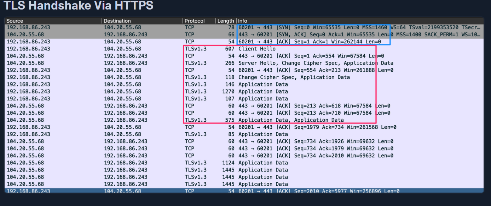
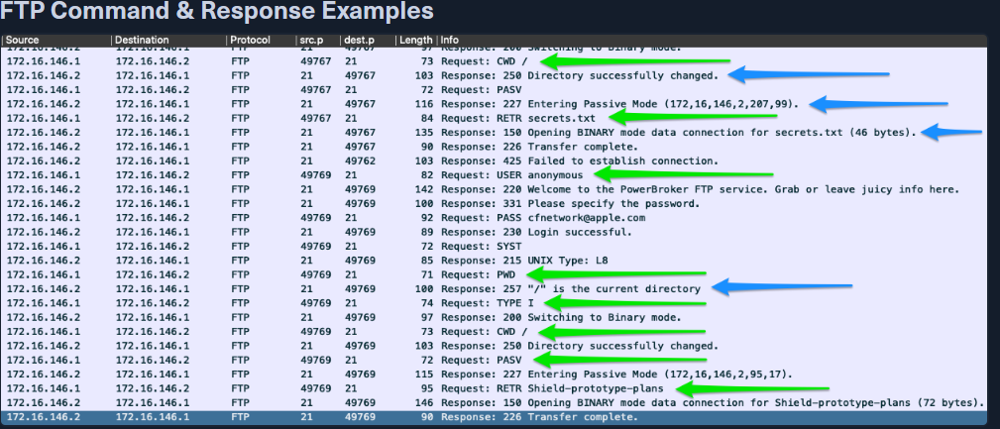

# Networking Primer - Layers 5-7

---

# ***Hack The Box – HTTP (Network Traffic Analysis)***

## 1. What is HTTP

- **HTTP (Hypertext Transfer Protocol)** is a **stateless Application Layer protocol**.
- In use since **1990**.
- Transfers data **in clear text** between **client and server**.
- Operates **over TCP**.
- **Default ports:**
    - `80` (standard)
    - `8000` (alternate)
- Can be configured to use **non-standard ports** and, rarely, **UDP**.

### HTTP Communication Flow

1. Client sends an **HTTP request**.
2. TCP session is established.
3. Server responds with requested resources:
    - HTML
    - Images
    - Hyperlinks
    - Videos

⚠️ Since HTTP is **clear text**, credentials, cookies, and content are visible in packet captures.

---

## 2. Stateless Nature of HTTP

- Each request is **independent**.
- Server does **not remember previous requests**.
- State is maintained using:
    - Cookies
    - Sessions
    - Tokens (visible in headers)

This is important when analyzing authentication and session hijacking in traffic.

---

## 3. HTTP Methods (Verbs)

HTTP methods define **what action is performed** on a resource (URI).

### Required Methods

These **must** exist in all HTTP implementations:

### GET

- Requests data from a server.
- Most common HTTP method.
- Example:
    
    `GET /index.html`
    

### HEAD

- Same as GET but **no response body**.
- Used to:
    - Check server status
    - Inspect headers
    - Perform reconnaissance

---

### Optional Methods

These may or may not be enabled on a server.

### POST

- Sends data to the server.
- Commonly used for:
    - Form submissions
    - Login requests
    - Social media posts
- Behavior depends on server logic.
- Always validate via **response codes**.

### PUT

- Creates **or replaces** a resource at a specific URI.
- If resource exists → **updated**
- If not → **created**
- Think: *overwrite or create*

**PUT vs POST (important for analysis):**

- **PUT:** Create/replace the object itself
- **POST:** Create child data related to the object

### DELETE

- Removes a resource at the specified URI.
- Dangerous if misconfigured.

### TRACE

- Echoes the request back to the client.
- Used for diagnostics.
- Can expose sensitive headers → often disabled.

### OPTIONS

- Lists supported HTTP methods on a server.
- Useful for:
    - Enumeration
    - Capability discovery
- Common in reconnaissance.

### CONNECT

- Used by proxies and firewalls.
- Establishes tunnels (e.g., HTTPS via proxy).
- Common in SSL/TLS tunneling.

---

## 4. Security & Traffic Analysis Relevance

When analyzing HTTP traffic, look for:

- Credentials in **POST requests**
- Session cookies in headers
- Suspicious methods (PUT, DELETE, TRACE)
- Non-standard ports running HTTP
- Clear-text sensitive data
- Unexpected HTTP traffic inside internal networks

Misconfigured HTTP servers often expose:

- Upload endpoints (PUT)
- Admin panels
- Debug methods (TRACE, OPTIONS)

---

## 5. Key Takeaways for NTA

- HTTP traffic is **easy to inspect** due to clear text.
- GET and HEAD are **always enabled**.
- Optional methods can indicate:
    - Misconfiguration
    - Exploitation attempts
    - Web shells or C2 traffic
- HTTP is frequently abused by attackers for:
    - Data exfiltration
    - Command-and-control
    - Credential harvesting

---

---

# ***Hack The Box – HTTPS (Network Traffic Analysis)***

## 1. What is HTTPS

- **HTTPS (HTTP Secure)** is HTTP wrapped inside **TLS (Transport Layer Security)**
    - Older implementations may use **SSL**
- Purpose: **Encrypt the entire client–server conversation**
- Protects against:
    - Man-in-the-Middle (MITM) attacks
    - Traffic sniffing
    - Session hijacking
    - Credential theft

Before TLS, anyone on the same LAN could **read HTTP traffic directly**.

---

## 2. Ports Used by HTTPS

- **443** → Standard HTTPS port
- **8443** → Alternate HTTPS port

Using port 443 is a **signal from the client** that it wants a **secure (TLS) connection**, not plain HTTP (80).

---

## 3. HTTPS vs HTTP (Traffic Perspective)

| Feature | HTTP | HTTPS |
| --- | --- | --- |
| Encryption | None | TLS encryption |
| Visibility in PCAP | Full payload visible | Payload encrypted |
| Default Port | 80 / 8000 | 443 / 8443 |
| Security | Vulnerable | Secure |

⚠️ With HTTPS, **content, credentials, and methods are hidden**, but **metadata is still visible** (IP, port, SNI, packet size, timing).

---

## 4. TLS Handshake via HTTPS (Packet View)

### 🔵 Blue Box (Port Identification)

- Initial packets show **TCP connection on port 443**
- Confirms HTTPS is being used
- TCP handshake occurs first (SYN → SYN/ACK → ACK)

---

### TLS Handshake Process

After TCP session establishment:

1. **ClientHello**
    - Client initiates TLS handshake
    - Proposes:
        - TLS version
        - Cipher suites
        - Session options
2. **ServerHello**
    - Server responds with:
        - Selected cipher suite
        - TLS parameters
        - **x.509 certificate**
3. **Key Exchange**
    - Client and server exchange cryptographic parameters
    - Generate a **premaster secret**
4. **Master Secret Generation**
    - Derived from:
        - Premaster secret
        - Random values exchanged
    - Used to encrypt session data
5. **Handshake Verification**
    - Both sides verify:
        - Same encryption parameters
        - No tampering occurred

---

### 🔴 Red Box (Encrypted Traffic)

- After handshake completion:
    - All traffic appears as **TLS Application Data**
- HTTP methods (GET, POST, etc.) are now **encrypted**
- Payload **cannot be read** without decryption keys

⚠️ Even though content is encrypted:

- TCP ACKs still visible
- Packet timing and size still observable

---

## 5. What TLS Encrypts

- HTTP methods
- URLs (path & parameters)
- Headers (cookies, authorization)
- Payloads (forms, credentials, data)

What TLS does **not hide**:

- Source & destination IP
- Destination port
- TLS handshake metadata
- Server Name Indication (SNI)

---

## 6. HTTPS in Network Traffic Analysis

### What Analysts Can Still Detect

- HTTPS usage on **non-standard ports**
- Suspicious certificate behavior
- Repeated encrypted connections to unknown hosts
- Beaconing patterns (C2 traffic)
- TLS version mismatches or weak ciphers

### Common Attacker Abuse

- C2 traffic hidden in HTTPS
- Data exfiltration over TLS
- Malware using port 443 to blend in

---

## 7. Key Takeaways

- HTTPS = **HTTP + TLS**
- Uses **ports 443 / 8443**
- TLS encrypts **entire session**, not just data
- In packet captures:
    - 🔵 Port 443 indicates HTTPS
    - 🔴 TLS Application Data = encrypted payload
- Analysts rely on **metadata, patterns, and anomalies**, not payload inspection

---

---

# ***Hack The Box – FTP (Network Traffic Analysis)***

## 1. What is FTP

- **FTP (File Transfer Protocol)** is an **Application Layer protocol**.
- Used for **file transfers between hosts**.
- Can be used via:
    - Command-line
    - Web browser (mostly deprecated)
    - GUI clients (e.g., FileZilla)
- **Insecure by design** → data and credentials sent in **clear text**.
- Modern environments prefer **SFTP / FTPS**.
- Most browsers **removed FTP support after 2020**.

---

## 2. FTP Ports & Architecture

FTP is **different from most protocols** because it uses **multiple TCP connections**.

| Port | Purpose |
| --- | --- |
| **21/TCP** | Control channel (commands & responses) |
| **20/TCP** | Data channel (file transfers) |
- **Control Channel (21):**
    - Authentication
    - Commands (LIST, RETR, CWD, etc.)
- **Data Channel (20):**
    - Actual file contents
    - Directory listings

⚠️ This separation is important when analyzing PCAPs.

---

## 3. Authentication in FTP

- Supports:
    - Username & password authentication
    - **Anonymous access** (if configured)
- Credentials are sent in **clear text**:
    - `USER`
    - `PASS`

This makes FTP extremely valuable during traffic analysis for **credential harvesting**.

---

## 4. FTP Modes of Operation

### Active Mode (Default)

- Client sends **PORT** command to server.
- Server initiates data connection **from port 20** to client-specified port.
- Often **blocked by firewalls/NAT**.

### Passive Mode

- Client sends **PASV** command.
- Server responds with:
    - IP address
    - Port number for data transfer
- Client initiates **both control and data connections**.
- Common in modern environments behind NAT/firewalls.

---

## 5. FTP Traffic in Packet Captures

### 🟢 Green Arrows – Client Commands

- Sent over **port 21**
- Examples:
    - Directory navigation
    - File requests
    - Mode switching

### 🔵 Blue Arrows – Server Responses

- Status codes and messages
- Confirm success or failure of commands

This clear separation makes FTP **easy to read in Wireshark**.

---

## 6. Common FTP Commands (Port 21)

| Command | Description |
| --- | --- |
| **USER** | Specifies username |
| **PASS** | Sends password |
| **PORT** | Sets data port (active mode) |
| **PASV** | Switches to passive mode |
| **LIST** | Lists directory contents |
| **CWD** | Change working directory |
| **PWD** | Print current directory |
| **SIZE** | Returns file size |
| **RETR** | Retrieves (downloads) file |
| **QUIT** | Ends FTP session |

⚠️ Not exhaustive — commands may vary by client or implementation.

---

## 7. FTP in Network Traffic Analysis

### What Analysts Look For

- Clear-text **USER / PASS** credentials
- Unauthorized file access
- Unexpected outbound FTP traffic
- Large file transfers (possible exfiltration)
- FTP on **non-standard ports**

### Common Attacker Abuse

- Credential harvesting
- Data exfiltration
- Malware staging servers
- Anonymous FTP misconfigurations

---

## 8. Key Takeaways

- FTP is **insecure and deprecated**, but still appears in real networks.
- Uses **two TCP connections** (control + data).
- Credentials and commands are **fully visible**.
- 🟢 Client commands and 🔵 server responses are easy to identify in PCAPs.
- FTP traffic should almost always raise **security interest** in modern environments.

---

---

# ***Hack The Box – SMB (Server Message Block)***

## 1. What is SMB

- **SMB (Server Message Block)** is a **connection-oriented Application Layer protocol**.
- Most commonly seen in **Windows enterprise environments**.
- Enables **resource sharing** between hosts:
    - File shares
    - Printers
    - Authentication services
- Requires **user authentication and authorization**.

Because SMB grants access to critical resources, it is **high-value for attackers**.

---

## 2. SMB Transport Mechanisms

### Legacy Transport

- **NetBIOS over UDP**
    - Ports **137 / 138**
- **NetBIOS over TCP**
    - Port **139**

### Modern Transport

- **Direct SMB over TCP**
    - **Port 445** (most common today)
- Also supports:
    - **QUIC** (newer implementations)

---

## 3. SMB on the Wire (Packet Capture)

### 🟠 Orange Boxes – TCP Handshake

- SMB uses **TCP**, so each session starts with:
    - SYN → SYN/ACK → ACK
- Multiple handshakes indicate:
    - Repeated connections
    - Possible authentication retries

---

### 🔵 Blue Box – Port Identification

- **Port 445** observed in source/destination ports
- Confirms **SMB over TCP**
- Key indicator when filtering traffic in Wireshark

---

### 🟢 Green Boxes – SMB Info Field

- Displays:
    - SMB commands
    - Authentication success or failure
    - Errors and status messages

⚠️ **Repeated errors** are a strong indicator of malicious activity.

---

## 4. Authentication Behavior & Attacker Indicators

### Normal Behavior

- Occasional authentication failure:
    - User typo
    - Expired session
- Followed by successful login

### Suspicious Behavior

- Large number of repeated authentication failures
- Multiple SMB sessions in short time windows
- Same credentials attempted across hosts

**Common attacker tactic:**

- Steal valid credentials
- Attempt **lateral movement**
- Access resources normally restricted

---

## 5. SMB Resource Access Patterns

### Normal SMB Activity

- Workstations accessing:
    - File servers
    - Domain controllers
- Servers accessing known shares

### Suspicious SMB Activity

- Host accessing **multiple file shares** across the network
- Non-server systems requesting admin shares
- Unexpected peer-to-peer SMB connections

Always evaluate:

- **Who** initiated the connection
- **Where** they connected
- **What** resource was requested

---

## 6. SMB in Network Traffic Analysis

### What Analysts Look For

- SMB traffic on **port 445**
- Authentication failures (clustered)
- Lateral movement indicators
- Abnormal share enumeration
- SMB from unusual hosts

### Common Attacker Abuse

- Credential reuse
- Pass-the-hash attacks
- Lateral movement
- Unauthorized file access

---

## 7. Key Takeaways

- SMB is **critical infrastructure traffic** in Windows networks.
- Uses **TCP** with standard handshakes 🟠.
- **Port 445 🔵** = modern SMB.
- **Repeated auth failures 🟢** are high-value indicators.
- SMB misuse is a strong sign of **internal compromise**.

---