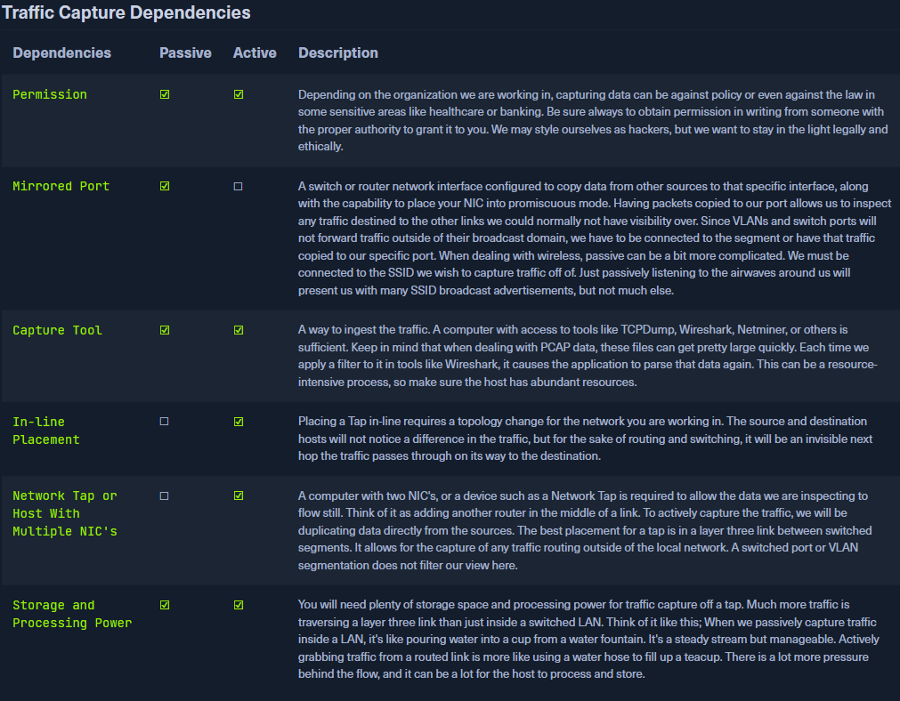

# The Analysis Process

---

## The Analysis Process — Notes

### Overview

- Network Traffic Analysis (NTA) is a **dynamic process**
- It changes based on:
    - Available tools
    - Permissions granted by the organization
    - Network visibility
- Goal: create a **repeatable process** for performing traffic analysis

---

### What is Traffic Analysis?

- Traffic Analysis = **detailed examination of an event or process**
- Determines:
    - Origin
    - Impact
- Used to:
    - Trigger precautions
    - Support or prevent future occurrences

**In network traffic analysis, this involves:**

- Breaking captured traffic into understandable chunks
- Examining traffic for:
    - Deviations from normal behavior
    - Potentially malicious activity such as:
        - Unauthorized remote access from the internet (RDP, SSH, Telnet)
        - Unusual traffic patterns before network issues
- Identifying trends in traffic
- Comparing observed traffic against a **baseline of typical operational traffic**

---

### Why NTA Is Important

- NTA is a **highly versatile and essential defensive tool**
- Without traffic monitoring:
    - A massive part of the security puzzle is missing

**What NTA provides:**

- Visibility into:
    - Network usage
    - Top-talking hosts and servers
    - Internal communications
- Helps administrators and defenders:
    - Identify issues
    - Correct problems before or shortly after they occur

**Baseline Creation**

- Capturing traffic over different time periods allows:
    - Creation of a baseline
    - Easier detection of changes or anomalies

**Advanced Implementations**

- NTA becomes even more powerful when combined with:
    - IDS / IPS
    - Firewalls
    - Host and network logs
    - SIEM tools (Splunk, ELK Stack)
- These tools:
    - Alert quickly on malicious actions
    - Use signatures for common attacks and toolkits

---

### NTA in Daily Operations

- NTA is not only for incident response
- Live traffic monitoring helps:
    - Troubleshoot connectivity issues
    - Verify infrastructure behavior
    - Confirm protocols are functioning correctly
- Seeing where traffic is going makes it easier to locate issues

---

### Automation vs Manual Analysis

- NTA is a **dynamic skill**
- Automated tools are useful and encouraged
- However:
    - They should **not be relied on exclusively**
- Manual checks are important because:
    - Tools can be bypassed
    - Attackers constantly evolve
- Human analysis provides:
    - Checks and balances
    - Direct visibility into the network
- The human eye remains one of the best resources for detection

---

## Analysis Dependencies

Traffic capture and analysis can be done in **two ways**:

- **Passive**
- **Active (In-line)**

### Passive Capture

- Copies traffic without interacting with packets
- Requires visibility into the network segment

### Active Capture (In-line)

- Requires a hands-on approach
- Also called **in-line traffic capture**
- Traffic flows directly through the capture device

Analysis can be done:

- After capture
- In real time while traffic is live

---

### Traffic Capture Dependencies Table (Explained)

**Permission (Passive & Active)**

- Capturing traffic may:
    - Violate organizational policy
    - Be illegal in regulated industries (healthcare, banking)
- Always obtain:
    - Written permission
    - From authorized personnel
- Ethical and legal operation is mandatory

**Mirrored Port (Passive Only)**

- Switch/router interface configured to copy traffic
- Requires NIC in promiscuous mode
- Allows inspection of traffic normally not visible
- VLANs limit visibility unless traffic is mirrored
- Wireless passive capture:
    - Requires connection to the target SSID
    - Passive listening only reveals SSID advertisements

**Capture Tool (Passive & Active)**

- Tools such as:
    - tcpdump
    - Wireshark
    - Netminer
- PCAP files:
    - Grow large quickly
    - Are resource-intensive to filter and analyze
- Host must have:
    - Adequate CPU
    - Sufficient memory and storage

**In-line Placement (Active Only)**

- Requires network topology changes
- Tap acts as an invisible hop
- Source and destination hosts are unaffected

**Network Tap / Multiple NICs (Active Only)**

- Requires:
    - A tap or
    - Host with two NICs
- Allows traffic to flow while being duplicated
- Best placement:
    - Layer 3 link between switched segments
- Captures routed traffic beyond the local LAN
- VLAN segmentation does not limit visibility here

**Storage & Processing Power (Passive & Active)**

- High requirements, especially for active capture
- Layer 3 links carry much more traffic
- Analogy:
    - Passive LAN capture = filling a cup from a fountain
    - Active routed capture = filling a teacup with a hose

---

## Importance of a Network Baseline

- Baseline understanding is strongly recommended
- Without it:
    - Analysis becomes slower and more difficult

### Scenario Explained

- Large corporate network with connectivity issues
- Symptoms:
    - High latency
    - New files appearing on desktops
- Administrator captures traffic for analysis

**Without a Baseline**

- Difficult to know what traffic is normal
- Must examine:
    - Every conversation
    - Every host
    - Potential rogue assets
- Quickly becomes overwhelming

**With a Baseline**

- Known-good traffic can be filtered out
- Tools like:
    - Wireshark “Top Talkers”
- Helps identify:
    - Hosts sending abnormal volumes of data
- Compare activity to normal behavior

**Example Findings**

- User PCs communicating over:
    - Port 8080
    - Port 445
- Ports themselves are common
- Behavior is abnormal:
    - User-to-user communication on these ports
- Normally:
    - Web traffic goes to servers
    - SMB traffic goes to file servers
- This behavior indicates:
    - Possible breach
- Action:
    - Escalate via trouble ticket immediately

---

### Key Takeaway

- Faster visibility = less damage during intrusions
- Success in NTA depends on:
    - Understanding normal traffic flow
    - Knowing how protocols typically behave

---

---

## Analysis in Practice — Notes

### Overview

- Builds on the previous section:
    - Defines NTA
    - Dependencies for performing analysis
    - Importance of monitoring traffic
- This section focuses on **workflow and key components**
- Analysis is **dynamic**, influenced by:
    - What you are looking for (network errors vs malicious activity)
    - Visibility into the network
- Can be distilled into **basic tenets**, but is not a fixed loop

---

### Types of Analysis

### 1️⃣ Descriptive Analysis

- Purpose: describe the data set to detect:
    - Errors in data collection
    - Outliers
- Steps:
    1. **Identify the issue**
        - Suspected breach? Network issue?
    2. **Define scope and goal**
        - Target: hosts potentially downloading `bad.example.com`
        - Timeframe: last 48 hours + 2 hours from now
        - Supporting info: filenames `superbad.exe`, `new-crypto-miner.exe`
    3. **Define targets**
        - Network: `192.168.100.0/24`
        - Protocols: HTTP, FTP
- Outcome: understand **what, when, and where** to investigate

---

### 2️⃣ Diagnostic Analysis

- Purpose: clarify **causes, effects, and interactions**
- Backward-looking, builds on descriptive analysis
- Steps:
    1. **Capture network traffic**
        - Live capture on the target network
        - Optionally, pull historical PCAP or NetFlow data from SIEM
    2. **Filter traffic**
        - Remove known-good traffic using baseline
        - Keep traffic relevant to scope (HTTP/FTP with suspected files)
    3. **Understand captured traffic**
        - For FTP: filter `ftp-data` to reconstruct transferred files
        - For HTTP: filter `http.request.method == "GET"` for filenames
        - Identify hosts that acquired files and potential internal transfers
- Outcome: **validate the cause** and understand the events surrounding the issue

---

### 3️⃣ Predictive Analysis

- Purpose: evaluate data to **predict future trends and deviations**
- Steps:
    1. **Note-taking and mind mapping**
        - Record:
            - Traffic capture timeframes
            - Suspicious hosts
            - Conversations involving files (timestamps, packet numbers)
    2. **Summary of findings**
        - Clearly explain results to decision-makers
        - Allows actions such as host quarantine or larger incident response
- Outcome: **predict future occurrences** and inform proactive actions

---

### 4️⃣ Prescriptive Analysis

- Purpose: decide on **actions to prevent or mitigate issues**
- Steps:
    1. Use workflow results to define remediation or prevention
    2. Reflect on the process:
        - Document lessons learned
        - Note what worked, what failed, and potential improvements
- Outcome: **cumulative knowledge**, improves future analysis

---

### End-to-End Workflow (Template)

1. Identify the issue
    - Suspected breach? Network error?
2. Define scope & goal
    - Target hosts, timeframe, supporting info
3. Define targets
    - Network, hosts, protocols
4. Capture network traffic
    - Live or historical (PCAP/NetFlow)
5. Filter traffic
    - Remove baseline traffic, keep relevant data
6. Analyze captured traffic
    - FTP: `ftp-data` reconstruction
    - HTTP: `GET` requests for suspicious files
7. Take notes / mind map findings
    - Record timestamps, hosts, conversations, packet numbers
8. Summarize analysis
    - Present clear info to superiors for action

**Note:** The process is often **cyclic**, especially in incident response. May need to:

- Reanalyze captured traffic
- Expand scope to other affected hosts
- Confirm full-scale attack activity

---

### Key Components of Effective Analysis

1. **Know Your Environment**
    - Maintain:
        - Asset inventories
        - Network maps
    - Helps identify rogue hosts
2. **Placement is Key**
    - Capture host should be **close to the source of the issue**
    - Internet-originating issues → monitor inbound links
    - Internal host issue → capture in the same segment
3. **Persistence**
    - Issues may be intermittent
    - Example: C2 callbacks may occur only hourly/daily
    - Repeated monitoring required to detect rare events

---

### Analysis Approach — Practical Tips

- Start with **common protocols** first:
    - HTTP/S, FTP, Email, TCP/UDP
- Clear out normal traffic first, then focus on anomalies
- Next, check **internal communication protocols**:
    - SSH, RDP, Telnet
    - Verify against **security policy**
- Look for patterns:
    - Hosts checking into external endpoints at consistent times → possible C2
- Monitor **host-to-host traffic**:
    - Normal: DHCP, DNS, enterprise services, domain controllers
    - Suspicious: unusual file sharing, SMB, or unexpected port use
- Watch for **unique events**:
    - Changes in traffic pattern
    - Unusual User-Agent strings
    - Random ports used rarely → potential C2 or abnormal app behavior
- Ask for help when needed:
    - Extra eyes on data can spot overlooked anomalies

---

### Summary

- NTA is **dynamic and situational**
- Requires:
    - Strong understanding of network behavior
    - Knowledge of protocols and baseline traffic
    - Persistence and careful analysis
- Tools can **enrich visibility** but **manual insight is critical**:
    - tcpdump, Wireshark
    - Snort, Security Onion, firewalls, SIEMs

---

I